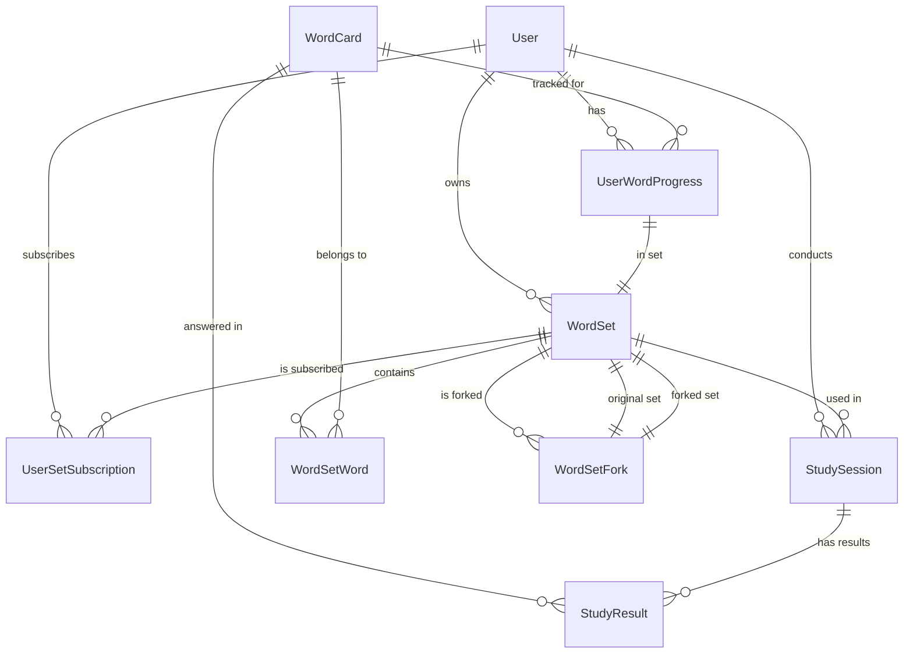
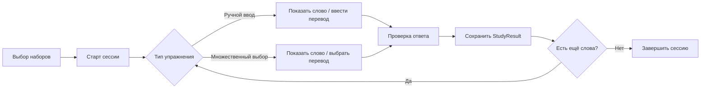

# План: Тематические наборы слов, активность изучения и аналитика

## Overview

Добавление в приложение English Words App трёх крупных функциональных блоков:

1. **Тематические наборы (WordSet)** — группировка слов в наборы с возможностью подписки и форка, системные (админские) и пользовательские наборы.
2. **Активность изучения (Study Activity)** — сессия изучения слов из выбранных наборов с двумя типами упражнений: ручной ввод перевода и выбор из нескольких вариантов.
3. **Аналитика (Analytics)** — вкладка со статистикой по наборам и отдельным словам.

Решение полностью перестраивает модель данных: вместо плоской коллекции слов у пользователя (UserCard) вводится иерархия Пользователь → Наборы → Слова.

## Context

### Текущее состояние

- Spring Boot 3.5.0 + Thymeleaf + Spring Security + JPA + PostgreSQL + Liquibase
- Сущности: `WordCard` (слово — englishWord, translation, example, notes, difficultyLevel), `UserCard` (связь пользователя со словом: addedAt, status), `User`, `Role`
- ~235 слов, все уровня BEGINNER, загружаются из CSV
- Слова плоские, без категорий/наборов
- Навигация: My Cards, Add Word, Random
- Нет изучения, нет аналитики

### Требования

- **Наборы**: Многие-ко-многим (WordSet ↔ WordCard). Системные (админские, неизменяемые) и пользовательские. Полное имя: `username/setName`. Автоматический набор "Мои словечки" при регистрации. Подписка (изучение чужих наборов) и форк (копия для редактирования). Видимость наборов.
- **Изучение**: Выбор одного или нескольких наборов → сессия → слова в случайном порядке с одним из двух типов заданий: ручной ввод перевода, выбор правильного перевода из вариантов.
- **Аналитика**: Для набора: кол-во слов, изучено/в процессе, попытки/процент успеха. Для слова: сколько раз показано, правильных/неправильных ответов, по типам заданий.

## Architecture / Design

### JPA-конвенции (обязательны для всех новых сущностей)

На основе анализа существующих сущностей (WordCard, UserCard, User):

1. **Lombok**: `@Getter @Setter @ToString` + `@NoArgsConstructor @AllArgsConstructor`
2. **equals/hashCode**: HibernateProxy-aware реализация (как в WordCard/UserCard)
3. **ID**: `@Id @GeneratedValue(strategy = GenerationType.IDENTITY)` с типом Long
4. **Таблицы**: явное имя через `@Table(name = "snake_case")`
5. **Колонки**: `@Column` с nullable, unique, length где необходимо
6. **Enums**: `@Enumerated(EnumType.STRING)` — хранить строкой
7. **LAZY загрузка**: `FetchType.LAZY` для всех `@ManyToOne` и `@OneToMany`
8. **@ToString.Exclude**: для lazy-ассоциаций (избежать LazyInitializationException)
9. **Даты**: `LocalDateTime` + `@PrePersist` / `@PreUpdate` для автоустановки
10. **Уникальность**: через `@Table(uniqueConstraints = @UniqueConstraint(...))` или `@Column(unique = true)`
11. **Cascade**: не каскадировать без явной необходимости (кроме удаления orphanRemoval)
12. **M:N связь**: через явную join-таблицу с внешними ключами
13. **Индексы**: добавлять FK-индексы для производительности

> **Каждая задача с созданием/модификацией JPA-сущности должна следовать этим конвенциям.**

### Ключевые решения

1. **WordSet** — новая сущность, агрегатор слов. Owner nullable (для системных). isSystem флаг.
2. **WordSetWord** — join table для M:N связи WordSet ↔ WordCard.
3. **UserSetSubscription** — подписка пользователя на изучение набора.
4. **WordSetFork** — форк набора (создание копии).
5. **StudySession** — сессия изучения (начало, конец, тип упражнения).
6. **StudyResult** — каждый ответ в сессии (слово, набор, правильно/нет, тип упражнения).
7. **UserWordProgress** — агрегированная статистика по слову в наборе для пользователя (derived from StudyResult или обновляемая).
8. Существующая `UserCard` упраздняется или адаптируется (её функционал покрывается подпиской на набор + StudyResult).
9. Системные наборы создаются через Liquibase migration. Начальные данные: существующие слова распределяются по системным наборам.
10. Frontend: Thymeleaf + CSS (без Tailwind, следует существующему стилю).

### Схема данных

### Поток изучения

## Development Approach

- **Testing approach**: Regular (код → тесты). Каждая задача включает написание тестов.
- Каждая задача выполняется полностью до перехода к следующей.
- Все тесты должны проходить перед переходом к следующей задаче.
- Обновлять план при изменении scope.

## Testing Strategy

- **TestContainers с PostgreSQL** — все интеграционные тесты (@DataJpaTest, @SpringBootTest) используют реальный PostgreSQL через TestContainers.
- **Unit-тесты** для сервисного слоя (Mockito mock репозиториев) — для чистой бизнес-логики, без БД.
- **Интеграционные тесты** для репозиториев (@DataJpaTest + TestContainers) — проверка JPA-запросов и миграций.
- **Интеграционные тесты** для контроллеров (@WebMvcTest или @SpringBootTest с TestContainers) — проверка эндпоинтов.
- **Базовый класс** для тестов с TestContainers: `AbstractIntegrationTest` с `@DynamicPropertySource` для настройки datasource из контейнера.
- Тесты охватывают success и error сценарии.
- Все тесты должны проходить перед переходом к следующей задаче.

## Implementation Steps

### Task 1: Инфраструктура тестирования + сущность WordSet и WordSetWord

**Files:**
- Create: `src/test/java/com/example/englishwordsapp/AbstractIntegrationTest.java`
- Create: `src/main/java/com/example/englishwordsapp/model/WordSet.java`
- Create: `src/main/java/com/example/englishwordsapp/repository/WordSetRepository.java`
- Modify: `src/main/java/com/example/englishwordsapp/model/WordCard.java` — добавить M:N связь с WordSet
- Create: `src/main/resources/db/changelog/changeset/003-create-word-sets.yaml`
- Create:`
- Create: `src/main/resources/db/changelog/changeset/004-distribute-words-to-sets.yaml`
- Modify: `src/main/resources/db/changelog/db.changelog-master.yaml`

- [ ] Создать `AbstractIntegrationTest` с TestContainers PostgreSQL:
  - `@SpringBootTest(webEnvironment = RANDOM_PORT)` + TestContainers `@ServiceConnection` или `@DynamicPropertySource`
  - Базовый класс для всех интеграционных тестов
- [ ] Создать сущность `WordSet` (id, name, description, owner — nullable, isSystem boolean, isVisible boolean default true, createdAt, updatedAt)
  - JPA-конвенции: Lombok, HibernateProxy equals/hashCode, LAZY для owner, @PrePersist/@PreUpdate
- [ ] Создать `WordSetRepository extends JpaRepository<WordSet, Long>`:
  - `findByOwnerId(Long ownerId)`
  - `findByIsSystemTrue()`
  - `findByNameContainingIgnoreCase(String name)`
  - `findByOwnerIdOrIsSystemTrue(Long ownerId)` — свои + системные
- [ ] Добавить в `WordCard` поле `@ManyToMany(mappedBy = "wordCards") Set<WordSet> wordSets` с LAZY
  - В `WordSet` — `@ManyToMany @JoinTable(name = "word_set_words") Set<WordCard> wordCards`
- [ ] Создать Liquibase changeset `003-create-word-sets.yaml`:
  - CREATE TABLE `word_sets` (id BIGSERIAL PK, name VARCHAR(255) NOT NULL, description TEXT, owner_id BIGINT nullable FK→users(id), is_system BOOLEAN DEFAULT FALSE, is_visible BOOLEAN DEFAULT TRUE, created_at TIMESTAMP DEFAULT NOW(), updated_at TIMESTAMP DEFAULT NOW())
  - CREATE TABLE `word_set_words` (word_set_id BIGINT NOT NULL, word_card_id BIGINT NOT NULL, PK (word_set_id, word_card_id))
  - FK на word_sets(id) и word_cards(id) с CASCADE DELETE
  - Индексы на FK-колонки
- [ ] Создать Liquibase changeset `004-distribute-words-to-sets.yaml`:
  - Создать администратора (если нет) или использовать system user id
  - Создать системные наборы: "Basic Words", "Verbs & Actions", "Adjectives & Adverbs", "People & Family", "Daily Life"
  - Распределить существующие слова из word_cards по наборам (INSERT в word_set_words)
- [ ] Включить changeset 003 и 004 в `db.changelog-master.yaml`
- [ ] Написать интеграционные тесты для WordSetRepository (extends AbstractIntegrationTest)
  - Тест создания набора, поиска по владельцу, поиска системных
  - Тест связи M:N (создать набор, добавить слова, проверить)
- [ ] Запустить тесты — должны проходить перед Task 2

### Task 2: Сущности подписки и форка наборов

**Files:**
- Create: `src/main/java/com/example/englishwordsapp/model/UserSetSubscription.java`
- Create: `src/main/java/com/example/englishwordsapp/model/WordSetFork.java`
- Create: `src/main/java/com/example/englishwordsapp/repository/UserSetSubscriptionRepository.java`
- Create: `src/main/java/com/example/englishwordsapp/repository/WordSetForkRepository.java`
- Create: `src/main/resources/db/changelog/changeset/005-create-set-subscriptions-and-forks.yaml`
- Modify: `src/main/resources/db/changelog/db.changelog-master.yaml`

- [ ] Создать `UserSetSubscription` (id, user → User, wordSet → WordSet, subscribedAt)
- [ ] Создать `WordSetFork` (id, originalSet → WordSet, forkedSet → WordSet, user → User, forkedAt)
- [ ] Создать репозитории для обоих
- [ ] Liquibase changeset `005`: CREATE TABLE `user_set_subscriptions` + `word_set_forks`
- [ ] Написать тесты репозиториев
- [ ] Запустить тесты — должны проходить перед Task 3

### Task 3: Сервис для работы с наборами (WordSetService)

**Files:**
- Create: `src/main/java/com/example/englishwordsapp/service/WordSetService.java`

- [ ] Реализовать методы WordSetService:
  - `getSystemSets()` — получить все системные наборы
  - `getUserSets(userId)` — получить наборы пользователя (свои + подписки)
  - `createSet(userId, name, description)` — создать пользовательский набор
  - `addWordToSet(setId, wordCardId)` — добавить слово в набор (проверка прав)
  - `removeWordFromSet(setId, wordCardId)` — удалить слово из набора
  - `subscribeToSet(userId, setId)` — подписаться на набор
  - `unsubscribeFromSet(userId, setId)` — отписаться от набора
  - `forkSet(userId, setId)` — создать форк набора (копия слов + новый набор)
  - `getSetWords(setId)` — получить слова набора
  - `getAvailableSets(userId)` — все наборы, доступные пользователю (системные + свои + чужие публичные)
  - `createDefaultUserSet(userId)` — создать "Мои словечки" при регистрации
- [ ] Валидация: системные наборы нельзя изменять/удалять обычным пользователям
- [ ] Написать unit-тесты WordSetService (mock репозитории)
- [ ] Запустить тесты — должны проходить перед Task 4

### Task 4: Интеграция создания дефолтного набора при регистрации

**Files:**
- Modify: `src/main/java/com/example/englishwordsapp/security/CustomOAuth2UserService.java`
- Modify: `src/main/java/com/example/englishwordsapp/security/CustomUserDetailsService.java`
- Modify: `src/main/java/com/example/englishwordsapp/controller/AuthController.java`

- [ ] В процесс регистрации пользователя добавить вызов `wordSetService.createDefaultUserSet(userId)`
- [ ] Для OAuth2 регистрации — аналогично
- [ ] Написать тесты создания дефолтного набора при регистрации
- [ ] Запустить тесты — должны проходить перед Task 5

### Task 5: REST и MVC контроллеры для наборов

**Files:**
- Create: `src/main/java/com/example/englishwordsapp/controller/WordSetController.java`
- Create: `src/main/java/com/example/englishwordsapp/controller/WordSetRestController.java`
- Modify: `src/main/java/com/example/englishwordsapp/config/SecurityConfig.java` — добавить security rules для /sets/**, /api/sets/**
- Modify: `src/main/resources/templates/fragments/header.html` — добавить навигацию Sets, Study

- [ ] WordSetController (MVC, Thymeleaf):
  - GET `/sets` — список доступных наборов (свои, системные, доступные)
  - GET `/sets/new` — форма создания набора
  - POST `/sets/create` — создание набора
  - GET `/sets/{id}` — просмотр набора (слова внутри)
  - POST `/sets/{id}/subscribe` — подписка
  - POST `/sets/{id}/unsubscribe` — отписка
  - POST `/sets/{id}/fork` — форк
  - POST `/sets/{id}/words/{wordId}/add` — добавить слово в набор
  - POST `/sets/{id}/words/{wordId}/remove` — удалить слово из набора
- [ ] WordSetRestController (JSON API):
  - GET `/api/sets` — все доступные наборы
  - GET `/api/sets/{id}` — детали набора
  - POST `/api/sets` — создать набор
  - POST `/api/sets/{id}/subscribe`
  - DELETE `/api/sets/{id}/subscribe` — отписка
  - POST `/api/sets/{id}/fork`
  - GET `/api/sets/{id}/words` — слова набора
- [ ] SecurityConfig: разрешить `/sets/**` и `/api/sets/**` только authenticated
- [ ] Header: добавить ссылки "Sets" и "Study" (заглушка)
- [ ] Базовая Thymeleaf-страница для списка наборов (вкладывается в layout)
- [ ] Написать тесты для контроллеров (MockMvc)
- [ ] Запустить тесты — должны проходить перед Task 6

### Task 6: Сущности StudySession и StudyResult

**Files:**
- Create: `src/main/java/com/example/englishwordsapp/model/StudySession.java`
- Create: `src/main/java/com/example/englishwordsapp/model/StudyResult.java`
- Create: `src/main/java/com/example/englishwordsapp/repository/StudySessionRepository.java`
- Create: `src/main/java/com/example/englishwordsapp/repository/StudyResultRepository.java`
- Create: `src/main/resources/db/changelog/changeset/006-create-study-tables.yaml`
- Modify: `src/main/resources/db/changelog/db.changelog-master.yaml`

- [ ] `StudySession` — id, user → User, startedAt, endedAt, exerciseType (TEXT_INPUT / MULTIPLE_CHOICE), wordCount
- [ ] `StudyResult` — id, studySession → StudySession, wordCard → WordCard, wordSet → WordSet, isCorrect boolean, exerciseType enum, answeredAt
- [ ] Репозитории: StudySessionRepository (по userId, по дате), StudyResultRepository (по сессии, по слову, по набору)
- [ ] Liquibase changeset `006`:
  - CREATE TABLE `study_sessions` (...)
  - CREATE TABLE `study_results` (...)
  - FK constraints
- [ ] Написать тесты репозиториев
- [ ] Запустить тесты — должны проходить перед Task 7

### Task 7: Сервис изучения (StudyService)

**Files:**
- Create: `src/main/java/com/example/englishwordsapp/service/StudyService.java`

- [ ] `startSession(userId, setIds, exerciseType)` — создать StudySession, перемешать слова из выбранных наборов
- [ ] `getNextWord(sessionId)` — вернуть следующее слово для текущей сессии (без повторов)
- [ ] `submitAnswer(sessionId, wordCardId, answer, exerciseType)`:
  - Для TEXT_INPUT: сравнить введённый текст с translation (case-insensitive, trim)
  - Для MULTIPLE_CHOICE: проверить правильность выбранного варианта
  - Сохранить StudyResult
- [ ] `getSessionResults(sessionId)` — получить результаты сессии
- [ ] `generateChoices(correctWordCardId, setIds, count)` — сгенерировать N вариантов (1 правильный + N-1 случайных из тех же наборов)
- [ ] `endSession(sessionId)` — завершить сессию
- [ ] Написать unit-тесты StudyService (mock репозитории)
- [ ] Запустить тесты — должны проходить перед Task 8

### Task 8: Контроллер и UI для активности изучения

**Files:**
- Create: `src/main/java/com/example/englishwordsapp/controller/StudyController.java`
- Create: `src/main/resources/templates/study.html`
- Create: `src/main/resources/templates/study-text-input.html` — фрагмент для ввода перевода
- Create: `src/main/resources/templates/study-multiple-choice.html` — фрагмент для выбора варианта
- Create: `src/main/resources/templates/study-results.html` — результаты сессии
- Modify: `src/main/java/com/example/englishwordsapp/config/SecurityConfig.java`
- Modify: `src/main/resources/static/css/main.css`
- Modify: `src/main/resources/templates/fragments/header.html`

- [ ] StudyController:
  - GET `/study` — страница выбора наборов
  - POST `/study/start` — начать сессию (setIds[], exerciseType)
  - GET `/study/session/{id}` — страница упражнения
  - POST `/study/session/{id}/answer` — отправить ответ
  - GET `/study/session/{id}/results` — результаты сессии
  - GET `/study/session/{id}/next` — следующее слово (AJAX или обычный редирект)
- [ ] Страница выбора наборов — чекбоксы для выбора 1+ наборов, радиокнопка для типа упражнения
- [ ] Страница упражнения TEXT_INPUT — показать английское слово, поле для ввода перевода, кнопка "Check"
- [ ] Страница упражнения MULTIPLE_CHOICE — показать английское слово, 4 варианта перевода (кнопки/радио), подсветка правильного/неправильного
- [ ] Страница результатов — сводка по сессии (правильно/всего, процент, список слов с результатами)
- [ ] JS: минимальный клиентский код для отправки ответов без перезагрузки (fetch)
- [ ] CSS: стили для страниц изучения (карточки слов, выбор вариантов, прогресс)
- [ ] Header: заменить "Random" на "Study", добавить активную ссылку
- [ ] SecurityConfig: разрешить `/study/**` authenticated
- [ ] Написать тесты StudyController (MockMvc)
- [ ] Запустить тесты — должны проходить перед Task 9

### Task 9: Аналитика — сущность UserWordProgress и сервис AnalyticsService

**Files:**
- Create: `src/main/java/com/example/englishwordsapp/model/UserWordProgress.java`
- Create: `src/main/java/com/example/englishwordsapp/repository/UserWordProgressRepository.java`
- Create: `src/main/java/com/example/englishwordsapp/service/AnalyticsService.java`
- Create: `src/main/resources/db/changelog/changeset/007-create-user-word-progress.yaml`
- Modify: `src/main/resources/db/changelog/db.changelog-master.yaml`

- [ ] `UserWordProgress` — id, user → User, wordCard → WordCard, wordSet → WordSet, totalAttempts, correctAnswers, lastPracticedAt
- [ ] Репозиторий: поиск по userId + wordSetId, по userId + wordCardId + wordSetId
- [ ] Liquibase changeset `007`: CREATE TABLE `user_word_progress` с уникальным constraint (user_id, word_card_id, word_set_id)
- [ ] `AnalyticsService.getSetStats(userId, wordSetId)` — статистика по набору:
  - totalWords (из WordSetWord)
  - totalAttempts, correctAnswers, successRate
  - wordsLearned (прогресс > 80% correct)
  - wordsInProgress (остальные)
- [ ] `AnalyticsService.getWordStats(userId, wordCardId, wordSetId)` — статистика по слову:
  - totalAttempts, correctAnswers, successRate
  - byExerciseType (TEXT_INPUT, MULTIPLE_CHOICE)
- [ ] `AnalyticsService.getAllSetsStats(userId)` — сводка по всем наборам пользователя
- [ ] Интеграция: обновлять UserWordProgress при каждом submitAnswer (в StudyService или отдельно)
- [ ] Написать unit-тесты AnalyticsService + тесты репозитория
- [ ] Запустить тесты — должны проходить перед Task 10

### Task 10: Контроллер и UI для аналитики

**Files:**
- Create: `src/main/java/com/example/englishwordsapp/controller/AnalyticsController.java`
- Create: `src/main/resources/templates/analytics.html`
- Create: `src/main/resources/templates/analytics-set-detail.html`
- Modify: `src/main/resources/templates/fragments/header.html`
- Modify: `src/main/resources/static/css/main.css`
- Modify: `src/main/java/com/example/englishwordsapp/config/SecurityConfig.java`

- [ ] AnalyticsController:
  - GET `/analytics` — сводка по всем наборам пользователя (таблица: набор, слов, попытки, успех)
  - GET `/analytics/sets/{id}` — детали по набору (список слов с прогрессом, общая статистика)
  - GET `/analytics/sets/{id}/words/{wordId}` — детали по слову (попытки по типам, график/прогресс)
- [ ] Страница `/analytics`:
  - Сводная таблица по всем наборам
  - Карточки/графики с визуализацией прогресса
- [ ] Страница `/analytics/sets/{id}`:
  - Прогресс-бар набора
  - Таблица слов: слово, перевод, попытки, правильные, успех %
  - Сортировка по убыванию/возрастанию успеха
- [ ] CSS: стили для аналитики (прогресс-бары, таблицы, карточки)
- [ ] Header: добавить ссылку "Analytics"
- [ ] SecurityConfig: разрешить `/analytics/**` authenticated
- [ ] Написать тесты AnalyticsController (MockMvc)
- [ ] Запустить тесты — должны проходить перед Task 11

### Task 11: Доработка существующей функциональности под новую модель

**Files:**
- Modify: `src/main/java/com/example/englishwordsapp/controller/WordCardController.java`
- Modify: `src/main/java/com/example/englishwordsapp/controller/WordCardRestController.java`
- Modify: `src/main/java/com/example/englishwordsapp/service/WordCardService.java`
- Modify: `src/main/resources/templates/index.html`
- Modify: `src/main/resources/templates/fragments/card-form.html`

- [ ] Адаптировать добавление слова: при создании слова пользователь теперь выбирает набор
- [ ] В форме добавления слова добавить выпадающий список наборов пользователя
- [ ] WordCardController.listCards — теперь отображает слова из выбранного набора, а не из плоской коллекции
- [ ] Обновить index.html для отображения с привязкой к набору
- [ ] WordCardService — адаптировать методы под новую модель (getUserCards → getUserSetWords)
- [ ] Обратная совместимость: старые UserCard можно мигрировать — создать набор "Мои словечки" и перенести туда слова
- [ ] Написать тесты для обновлённых методов
- [ ] Запустить тесты — должны проходить перед Task 12

### Task 12: Liquibase миграция существующих данных

**Files:**
- Create: `src/main/resources/db/changelog/changeset/008-migrate-existing-user-cards.yaml`
- Modify: `src/main/resources/db/changelog/db.changelog-master.yaml`

- [ ] Создать changeset для миграции существующих записей UserCard:
  - Для каждого пользователя, у которого есть UserCard, создать или найти набор "Мои словечки"
  - Перенести слова из UserCard в word_set_words для этого набора
  - UserCard остаётся для обратной совместимости (можно удалить позже)
- [ ] Написать тесты миграции (или проверить вручную на тестовых данных)
- [ ] Запустить тесты — должны проходить перед Task 13

### Task 13: Финальная проверка и тестирование

**Files:**
- Modify: `src/main/resources/static/css/main.css`

- [ ] Проверить навигацию: Sets, Study, Analytics — все ссылки работают
- [ ] Проверить сценарий: регистрация → создан "Мои словечки" → добавление слов → изучение → аналитика
- [ ] Проверить сценарий: подписка на системный набор → изучение → аналитика
- [ ] Проверить сценарий: форк набора → редактирование форка
- [ ] Проверить error case: попытка редактировать системный набор обычным пользователем
- [ ] Полировка UI: единый стиль для всех новых страниц
- [ ] Запустить полный набор тестов: `./gradlew test`
- [ ] Убедиться, что все тесты проходят

### Task 14: [Final] Обновление документации

- [ ] Обновить README.md с описанием новых возможностей
- [ ] Переместить план в `docs/plans/completed/`

## Post-Completion

**Ручная верификация:**
- Проверить UI всех новых страниц в браузере
- Проверить адаптивность (мобильная версия)
- Проверить сценарии с несколькими пользователями

**Внешние системы:**
- Нет внешних зависимостей (image exercise отложен)
