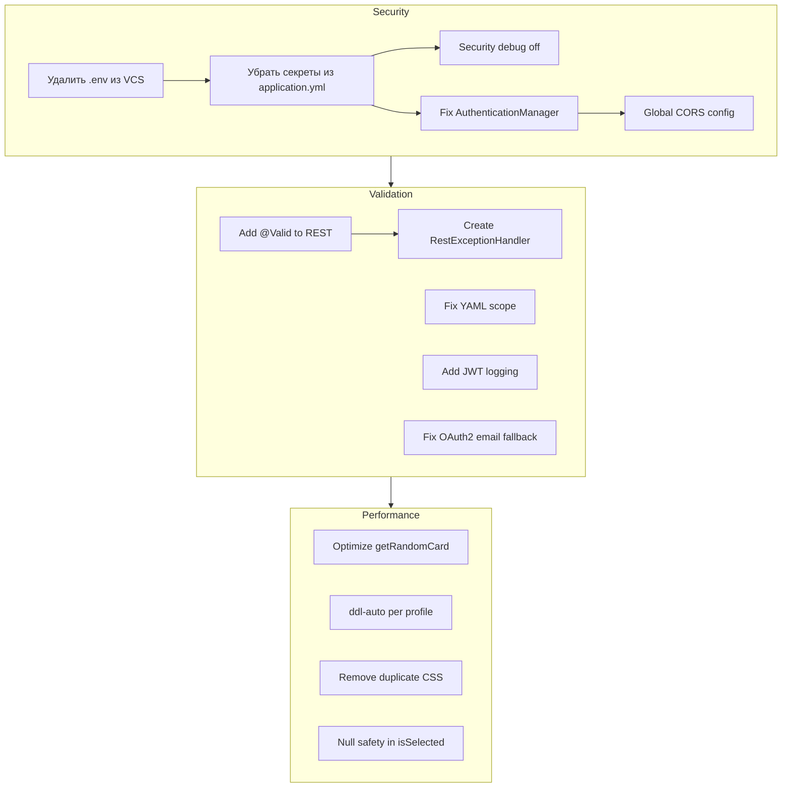

# План исправлений по результатам ревью

## Обзор

Ревью выявило **3 критических**, **8 предупреждений** и **4 предложения** в uncommitted изменениях ветки `spring-boot-англ-слова-карточки-d8b2d`. Изменения добавляют JWT-аутентификацию, OAuth2 (Google), form login, сущности User/Role, рефакторинг JTE-шаблонов с inline CSS на отдельные файлы.

План разбит на 3 категории, каждая с конкретными файлами и изменениями.

---

## Категория 1: Безопасность (приоритет: высокий)

### 1.1 Удалить `.env` из VCS и заменить application.yml defaults

**Файлы:**
- [`.env`](.env)
- [`src/main/resources/application.yml`](src/main/resources/application.yml:24)

**Описание:** Файл `.env` закоммичен в репозиторий с реальными `GOOGLE_CLIENT_ID` и `GOOGLE_CLIENT_SECRET`. В [`application.yml:24-25`](src/main/resources/application.yml:24) те же credentials прописаны как fallback-значения через `${GOOGLE_CLIENT_ID:...}`.

**Действия:**
1. Выполнить `git rm --cached .env` — убрать из отслеживания (`.gitignore` уже содержит `.env`, но файл попал в индекс до обновления gitignore).
2. Заменить в [`application.yml`](src/main/resources/application.yml:24) строки:
   ```yaml
   # Было:
   client-id: ${GOOGLE_CLIENT_ID:927443044940-...}
   client-secret: ${GOOGLE_CLIENT_SECRET:GOCSPX-...}
   # Стало:
   client-id: ${GOOGLE_CLIENT_ID}
   client-secret: ${GOOGLE_CLIENT_SECRET}
   ```

### 1.2 Удалить JWT secret default из application.yml

**Файл:** [`src/main/resources/application.yml:46`](src/main/resources/application.yml:46)

**Описание:** Hardcoded JWT secret `Y2hhbmdlbWUtaW4tcHJvZHVjdGlvbi10aGlzLWlzLWEtMzItYnl0ZS1zZWNyZXQta2V5` известен всем, кто имеет доступ к репозиторию.

**Действия:**
1. Заменить строку:
   ```yaml
   # Было:
   secret: ${JWT_SECRET:Y2hhbmdlbWUtaW4tcHJvZHVjdGlvbi10aGlzLWlzLWEtMzItYnl0ZS1zZWNyZXQta2V5}
   # Стало:
   secret: ${JWT_SECRET}
   ```

### 1.3 Отключить Security debug в production

**Файл:** [`src/main/java/com/example/englishwordsapp/config/SecurityConfig.java:21`](src/main/java/com/example/englishwordsapp/config/SecurityConfig.java:21)

**Описание:** `@EnableWebSecurity(debug = true)` логирует все заголовки HTTP-запросов, включая Authorization с JWT.

**Действия:**
1. Убрать `debug = true`:
   ```java
   // Было:
   @EnableWebSecurity(debug = true)
   // Стало:
   @EnableWebSecurity
   ```
   **Или** сделать условным через профиль.

### 1.4 Исправить создание AuthenticationManager

**Файл:** [`src/main/java/com/example/englishwordsapp/config/SecurityConfig.java:41-45`](src/main/java/com/example/englishwordsapp/config/SecurityConfig.java:42)

**Описание:** Явное создание `new ProviderManager(authProvider)` может конфликтовать с auto-configuration Spring Boot, что сломает OAuth2-логин.

**Действия:**
1. Внедрить `AuthenticationConfiguration` через конструктор.
2. Заменить:
   ```java
   // Было:
   @Bean
   public AuthenticationManager authenticationManager() {
       DaoAuthenticationProvider authProvider = new DaoAuthenticationProvider(customUserDetailsService);
       authProvider.setPasswordEncoder(passwordEncoder());
       return new ProviderManager(authProvider);
   }
   // Стало:
   @Bean
   public AuthenticationManager authenticationManager(AuthenticationConfiguration authConfig) throws Exception {
       return authConfig.getAuthenticationManager();
   }
   ```
3. `DaoAuthenticationProvider` будет зарегистрирован через `CustomUserDetailsService` самостоятельно.

### 1.5 Исправить CORS-политику

**Файлы:**
- [`src/main/java/com/example/englishwordsapp/controller/WordCardRestController.java:14`](src/main/java/com/example/englishwordsapp/controller/WordCardRestController.java:14)
- [`src/main/java/com/example/englishwordsapp/config/SecurityConfig.java`](src/main/java/com/example/englishwordsapp/config/SecurityConfig.java)

**Описание:** `@CrossOrigin(origins = "*")` разрешает доступ с любого домена.

**Действия:**
1. Убрать `@CrossOrigin` из REST-контроллера.
2. Добавить глобальную CORS-конфигурацию в `SecurityConfig`:
   ```java
   @Bean
   public CorsConfigurationSource corsConfigurationSource() {
       CorsConfiguration config = new CorsConfiguration();
       config.setAllowedOrigins(Arrays.asList("http://localhost:8080"));
       config.setAllowedMethods(Arrays.asList("GET", "POST", "PUT", "DELETE", "OPTIONS"));
       config.setAllowedHeaders(Arrays.asList("*"));
       config.setAllowCredentials(true);
       UrlBasedCorsConfigurationSource source = new UrlBasedCorsConfigurationSource();
       source.registerCorsConfiguration("/api/**", config);
       return source;
   }
   ```
3. В `SecurityFilterChain` добавить: `.cors(cors -> cors.configurationSource(corsConfigurationSource()))`.

---

## Категория 2: Валидация и обработка ошибок (приоритет: средний)

### 2.1 Добавить @Valid в REST Controller

**Файл:** [`src/main/java/com/example/englishwordsapp/controller/WordCardRestController.java:32,37`](src/main/java/com/example/englishwordsapp/controller/WordCardRestController.java:32)

**Описание:** `@NotBlank` аннотации на `WordCard.englishWord` и `WordCard.translation` не проверяются в REST-эндпоинтах.

**Действия:**
1. Добавить `import jakarta.validation.Valid;`.
2. Добавить `@Valid` перед `@RequestBody`:
   ```java
   public WordCard createCard(@Valid @RequestBody WordCard wordCard) { ... }
   public ResponseEntity<WordCard> updateCard(@PathVariable Long id, @Valid @RequestBody WordCard wordCard) { ... }
   ```
3. Создать [`src/main/java/com/example/englishwordsapp/global/RestExceptionHandler.java`](src/main/java/com/example/englishwordsapp/global/RestExceptionHandler.java) — `@RestControllerAdvice` с `@ExceptionHandler(MethodArgumentNotValidException.class)` для возврата 400 с описанием ошибок.

### 2.2 Исправить пустой элемент YAML-списка scope

**Файл:** [`src/main/resources/application.yml:29`](src/main/resources/application.yml:29)

**Описание:** Пустой элемент `-` под `scope:` может вызвать ошибку парсинга.

**Действия:**
1. Удалить пустую строку:
   ```yaml
   scope:
     - email
     - profile
   ```

### 2.3 Добавить логирование в JwtService.validateToken()

**Файл:** [`src/main/java/com/example/englishwordsapp/security/JwtService.java:61-64`](src/main/java/com/example/englishwordsapp/security/JwtService.java:61)

**Описание:** Все JWT-исключения проглатываются без логирования, что делает диагностику невозможной.

**Действия:**
1. Добавить `import lombok.extern.slf4j.Slf4j;`.
2. Добавить `@Slf4j` на класс.
3. Заменить комментарий на:
   ```java
   } catch (SecurityException | MalformedJwtException | ExpiredJwtException |
            UnsupportedJwtException | IllegalArgumentException e) {
       log.warn("JWT token validation failed: {}", e.getMessage());
   }
   ```

### 2.4 Добавить fallback для email в CustomOAuth2UserService

**Файл:** [`src/main/java/com/example/englishwordsapp/security/CustomOAuth2UserService.java:52`](src/main/java/com/example/englishwordsapp/security/CustomOAuth2UserService.java:52)

**Описание:** Если Google не возвращает email при OAuth2-логине, `user.setEmail(null)` вызовет `DataIntegrityViolationException`, так как `email` в [`User.java:26`](src/main/java/com/example/englishwordsapp/security/User.java:26) — `nullable = false`.

**Действия:**
1. Заменить:
   ```java
   user.setEmail(email);
   ```
   на:
   ```java
   user.setEmail(email != null ? email : providerId + "@oauth2." + registrationId);
   ```

---

## Категория 3: Производительность и конфигурация (приоритет: низкий / suggestion)

### 3.1 Оптимизировать getRandomCard()

**Файл:** [`src/main/java/com/example/englishwordsapp/service/WordCardService.java:61-67`](src/main/java/com/example/englishwordsapp/service/WordCardService.java:61)

**Описание:** Загружает все записи в память, затем выбирает случайную. С ростом данных — проблема производительности.

**Действия:**
1. Добавить в [`WordCardRepository`](src/main/java/com/example/englishwordsapp/repository/WordCardRepository.java) метод:
   ```java
   @Query(value = "SELECT * FROM word_cards ORDER BY RANDOM() LIMIT 1", nativeQuery = true)
   Optional<WordCard> findRandomCard();
   ```
2. В [`WordCardService`](src/main/java/com/example/englishwordsapp/service/WordCardService.java) использовать его:
   ```java
   public WordCard getRandomCard() {
       return wordCardRepository.findRandomCard().orElse(null);
   }
   ```

### 3.2 Настроить ddl-auto по профилям

**Файл:** [`src/main/resources/application.yml:13`](src/main/resources/application.yml:13)

**Описание:** `ddl-auto: validate` требует предварительно созданной схемы БД. В dev-режиме удобнее `update`.

**Действия:**
1. Вернуть в [`application.yml`](src/main/resources/application.yml:13) значение `update` (или оставить `validate` и добавить Flyway/Liquibase).
2. Добавить в [`application-prod.yml`](src/main/resources/application-prod.yml):
   ```yaml
   spring:
     jpa:
       hibernate:
         ddl-auto: validate
   ```

### 3.3 Удалить дублирующиеся CSS-правила

**Файл:** [`src/main/resources/static/css/card-form.css:44-131`](src/main/resources/static/css/card-form.css:44)

**Описание:** Строки 44-131 полностью дублируют стили, уже определённые в common.css и в строках 1-43 этого же файла.

**Действия:**
1. Удалить весь блок с 44 по 131 строку.

### 3.4 Добавить null safety в isSelected() (опционально)

**Файл:** [`src/main/java/com/example/englishwordsapp/model/WordCard.java:43-45`](src/main/java/com/example/englishwordsapp/model/WordCard.java:43)

**Действия:**
1. Текущая реализация корректна для не-null значений, но можно добавить явную проверку:
   ```java
   public boolean isSelected(DifficultyLevel lvl) {
       return difficultyLevel != null && difficultyLevel == lvl;
   }
   ```

---

## Порядок выполнения (рекомендуемая последовательность)

| Шаг | Категория | Задача | Файлы | Зависимости |
|-----|-----------|--------|-------|-------------|
| 1 | 1 | Удалить .env из VCS + исправить application.yml defaults | `.env`, `application.yml` | — |
| 2 | 1 | Удалить JWT secret default | `application.yml` | — |
| 3 | 2 | Исправить scope в application.yml | `application.yml` | — |
| 4 | 1 | Исправить AuthenticationManager + CORS + Security debug | `SecurityConfig.java` | — |
| 5 | 1 | Убрать @CrossOrigin из контроллера | `WordCardRestController.java` | 4 |
| 6 | 2 | Добавить @Valid в REST | `WordCardRestController.java`, создать `RestExceptionHandler.java` | — |
| 7 | 2 | Добавить логирование JWT | `JwtService.java` | — |
| 8 | 2 | Добавить fallback для OAuth2 email | `CustomOAuth2UserService.java` | — |
| 9 | 3 | Оптимизировать getRandomCard | `WordCardRepository.java`, `WordCardService.java` | — |
| 10 | 3 | Настроить ddl-auto по профилям | `application.yml`, `application-prod.yml` | — |
| 11 | 3 | Удалить дублирующийся CSS | `card-form.css` | — |
| 12 | 3 | Null safety в isSelected | `WordCard.java` | — |

---

## Диаграмма потока изменений



---

## Используемые навыки

При выполнении задач могут потребоваться:
- [`spring-security-configuration`](../.kilocode/skills/spring-security-configuration/SKILL.md) — для правки SecurityConfig
- [`spring-data-jpa`](../.kilocode/skills/spring-data-jpa/SKILL.md) — для правки репозиториев и сущностей
