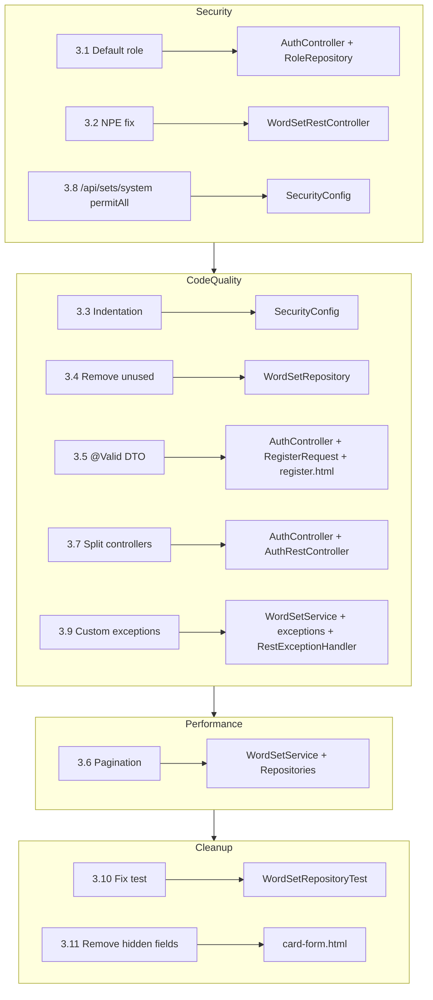

# План исправления замечаний ревью

## 1. Обзор

Ревью незакоммиченных изменений на ветке `dev` выявило **6 предупреждений (WARNING)** и **5 предложений (SUGGESTION)**. План описывает конкретные шаги для исправления каждой проблемы, сгруппированные по приоритету и логике.

---

## 2. Легенда приоритетов

| Приоритет | Значение |
|-----------|----------|
| 🔴 HIGH | Может вызвать ошибки в production или проблемы безопасности |
| 🟡 MEDIUM | Ухудшает качество кода, затрудняет поддержку |
| 🟢 LOW | Улучшения, не влияющие на функциональность (suggestion) |

---

## 3. Проблемы и решения

### 🔴 HIGH: Проблемы безопасности

#### 3.1 Пользователь без ролей при регистрации

**Файл:** [`AuthController.java:122`](../../src/main/java/com/example/englishwordsapp/controller/AuthController.java:122)

**Проблема:** `user.setRoles(new HashSet<>())` — пользователь сохраняется с пустым набором ролей. Хотя текущая `SecurityConfig` не проверяет роли (только `.authenticated()`), это может вызвать проблемы при добавлении role-based access control в будущем. Часть endpoint'ов может сломаться, если они ожидают хотя бы базовую роль.

**Решение:** Назначить роль `ROLE_USER` по умолчанию при регистрации.

**Изменения в [`AuthController.java`](../../src/main/java/com/example/englishwordsapp/controller/AuthController.java:122):**
```java
// Было:
user.setRoles(new HashSet<>());

// Стало:
Role userRole = roleRepository.findByName("ROLE_USER")
        .orElseThrow(() -> new RuntimeException("Default role not found"));
Set<Role> roles = new HashSet<>();
roles.add(userRole);
user.setRoles(roles);
```

**Новый файл:** [`RoleRepository.java`](../../src/main/java/com/example/englishwordsapp/repository/RoleRepository.java)
```java
package com.example.englishwordsapp.repository;

import com.example.englishwordsapp.security.Role;
import org.springframework.data.jpa.repository.JpaRepository;

import java.util.Optional;

public interface RoleRepository extends JpaRepository<Role, Long> {
    Optional<Role> findByName(String name);
}
```

**Изменения в [`AuthController.java`](../../src/main/java/com/example/englishwordsapp/controller/AuthController.java):**
- Добавить инъекцию `RoleRepository roleRepository`
- Убрать `import java.util.HashSet` (если больше не используется) — заменить на импорт для `Set`, `Role`

---

#### 3.2 Потенциальный NPE в WordSetRestController

**Файл:** [`WordSetRestController.java:22-25,27-30`](../../src/main/java/com/example/englishwordsapp/controller/WordSetRestController.java:22)

**Проблема:** Методы `getAvailableSets()` и `getMySets()` принимают `@AuthenticationPrincipal CustomUserDetails userDetails` и сразу вызывают `userDetails.getId()` без проверки на `null`. Если endpoint по какой-то причине доступен неаутентифицированному пользователю (изменение конфигурации безопасности), произойдёт NPE.

Эндпоинты `GET /api/sets/system` (строка 32) эту проблему не имеют, так как не используют `userDetails`.

**Решение:** Добавить проверку на `null` и возвращать `401 Unauthorized`.

**Изменения в [`WordSetRestController.java`](../../src/main/java/com/example/englishwordsapp/controller/WordSetRestController.java:22):**

```java
@GetMapping
public ResponseEntity<?> getAvailableSets(@AuthenticationPrincipal CustomUserDetails userDetails) {
    if (userDetails == null) {
        return ResponseEntity.status(HttpStatus.UNAUTHORIZED).build();
    }
    return ResponseEntity.ok(wordSetService.getAvailableSets(userDetails.getId()));
}

@GetMapping("/my")
public ResponseEntity<?> getMySets(@AuthenticationPrincipal CustomUserDetails userDetails) {
    if (userDetails == null) {
        return ResponseEntity.status(HttpStatus.UNAUTHORIZED).build();
    }
    return ResponseEntity.ok(wordSetService.getUserSets(userDetails.getId()));
}
```

**Добавить импорт:**
```java
import org.springframework.http.HttpStatus;
```

---

### 🟡 MEDIUM: Качество кода

#### 3.3 Индентация SecurityConfig — табы вместо пробелов

**Файл:** [`SecurityConfig.java`](../../src/main/java/com/example/englishwordsapp/config/SecurityConfig.java:53-103)

**Проблема:** Весь файл отформатирован табами (строки 53-103). Стандарт Java предполагает пробелы (обычно 4 пробела). Это создаёт шум в diff'е.

**Решение:** Переформатировать файл, заменив табы на 4 пробела.

**Изменения в [`SecurityConfig.java`](../../src/main/java/com/example/englishwordsapp/config/SecurityConfig.java:53-103):**
- Каждый таб заменить на 4 пробела.
- Строки 53-103 должны выглядеть так (показаны не все строки, а только принцип):

```java
    @Bean
    public SecurityFilterChain securityFilterChain(HttpSecurity http) throws Exception {
        http
            .csrf(csrf -> csrf
                .ignoringRequestMatchers("/api/**")
            )
            // ... остальные настройки с пробелами
        return http.build();
    }
```

---

#### 3.4 Неиспользуемый метод репозитория

**Файл:** [`WordSetRepository.java:23-24`](../../src/main/java/com/example/englishwordsapp/repository/WordSetRepository.java:23)

**Проблема:** Метод `findAvailableForUser` объявлен, но нигде не используется в проекте. Мёртвый код.

**Решение:** Удалить метод.

**Изменения в [`WordSetRepository.java`](../../src/main/java/com/example/englishwordsapp/repository/WordSetRepository.java:23):**
```java
    // Удалить строки 23-24:
    // @Query("SELECT ws FROM WordSet ws WHERE ws.owner.id = :ownerId OR ws.isVisible = true")
    // List<WordSet> findAvailableForUser(@Param("ownerId") Long ownerId);
```
**Заметка**
пока не делаем, метод может пригодится в будущем
---

#### 3.5 Ручная валидация регистрации вместо @Valid DTO

**Файл:** [`AuthController.java:69-126`](../../src/main/java/com/example/englishwordsapp/controller/AuthController.java:69)

**Проблема:** Валидация полей регистрации (пароль, email, username) выполняется через последовательность `if`-блоков. Это дублирует логику, усложняет тестирование и поддержку.

**Решение:** Создать DTO `RegisterRequest` с Jakarta Validation аннотациями и использовать `@Valid` в контроллере.

**Новый файл:** [`RegisterRequest.java`](../../src/main/java/com/example/englishwordsapp/dto/RegisterRequest.java)

```java
package com.example.englishwordsapp.dto;

import jakarta.validation.constraints.Email;
import jakarta.validation.constraints.NotBlank;
import jakarta.validation.constraints.Size;
import lombok.Data;

@Data
public class RegisterRequest {

    @NotBlank(message = "Username is required")
    @Size(min = 3, max = 50, message = "Username must be between 3 and 50 characters")
    private String username;

    @NotBlank(message = "Email is required")
    @Email(message = "Invalid email format")
    private String email;

    @NotBlank(message = "Password is required")
    @Size(min = 6, max = 100, message = "Password must be at least 6 characters long")
    private String password;

    @NotBlank(message = "Password confirmation is required")
    private String confirmPassword;
}
```

**Изменения в [`AuthController.java`](../../src/main/java/com/example/englishwordsapp/controller/AuthController.java:69):**

```java
@PostMapping("/register")
public String registerUser(@Valid @ModelAttribute("registerRequest") RegisterRequest registerRequest,
                           BindingResult bindingResult,
                           Model model) {
    if (bindingResult.hasErrors()) {
        model.addAttribute("username", registerRequest.getUsername());
        model.addAttribute("email", registerRequest.getEmail());
        return "register";
    }

    // Validate passwords match (cannot be done via annotation easily)
    if (!registerRequest.getPassword().equals(registerRequest.getConfirmPassword())) {
        bindingResult.rejectValue("confirmPassword", "error.registerRequest", "Passwords do not match.");
        model.addAttribute("username", registerRequest.getUsername());
        model.addAttribute("email", registerRequest.getEmail());
        return "register";
    }

    // Check if username already exists
    if (userRepository.existsByUsername(registerRequest.getUsername())) {
        bindingResult.rejectValue("username", "error.registerRequest", "Username is already taken.");
        model.addAttribute("username", registerRequest.getUsername());
        model.addAttribute("email", registerRequest.getEmail());
        return "register";
    }

    // Check if email already exists
    if (userRepository.existsByEmail(registerRequest.getEmail())) {
        bindingResult.rejectValue("email", "error.registerRequest", "Email is already registered.");
        model.addAttribute("username", registerRequest.getUsername());
        model.addAttribute("email", registerRequest.getEmail());
        return "register";
    }

    // Create and save the user
    User user = new User();
    user.setUsername(registerRequest.getUsername());
    user.setEmail(registerRequest.getEmail());
    user.setPassword(passwordEncoder.encode(registerRequest.getPassword()));
    // ... роли и остальные поля
    userRepository.save(user);

    return "redirect:/login?registered";
}
```

**Также нужно обновить [`register.html`](../../src/main/resources/templates/register.html):**
- Форма должна отправлять `registerRequest` объект (с `th:object="\${registerRequest}"`)
- Показать ошибки валидации через `th:errors`

**Добавить импорты в [`AuthController.java`](../../src/main/java/com/example/englishwordsapp/controller/AuthController.java):**
```java
import com.example.englishwordsapp.dto.RegisterRequest;
import org.springframework.validation.BindingResult;
```

**Важно:** Удалить `@RequestParam` параметры и использовать `@ModelAttribute RegisterRequest registerRequest`.

---

### 🟡 MEDIUM: Производительность

#### 3.6 Загрузка всех слов набора в память

**Файл:** [`WordSetService.java:55`](../../src/main/java/com/example/englishwordsapp/service/WordSetService.java:55)

**Проблема:** `List.copyOf(wordSet.getWordCards())` загружает все слова набора в оперативную память. При росте набора это может привести к проблемам производительности.

**Решение:** Т.к. текущий масштаб данных небольшой, можно использовать `@EntityGraph` для жадной загрузки (чтобы избежать N+1) и добавить TODO на будущую пагинацию. Либо сразу реализовать пагинацию.

**Вариант A (быстрое исправление, текущий масштаб):**
Изменить метод на использование `@EntityGraph` и оставить `List.copyOf` с комментарием.

**Изменения в [`WordSetService.java`](../../src/main/java/com/example/englishwordsapp/service/WordSetService.java:53-57):**
```java
@Transactional(readOnly = true)
public List<WordCard> getSetWords(Long setId) {
    WordSet wordSet = wordSetRepository.findByIdWithWords(setId)
            .orElseThrow(() -> new RuntimeException("WordSet not found with id: " + setId));
    // TODO: implement pagination when sets grow large
    return List.copyOf(wordSet.getWordCards());
}
```

**Изменения в [`WordSetRepository.java`](../../src/main/java/com/example/englishwordsapp/repository/WordSetRepository.java):**
```java
import org.springframework.data.jpa.repository.EntityGraph;

@EntityGraph(attributePaths = {"wordCards"})
@Query("SELECT ws FROM WordSet ws WHERE ws.id = :id")
Optional<WordSet> findByIdWithWords(@Param("id") Long id);
```

**Вариант B (рекомендуемый, пагинация):**
Добавить отдельный endpoint с пагинацией и использовать его в клиенте.

**Изменения в [`WordSetRestController.java`](../../src/main/java/com/example/englishwordsapp/controller/WordSetRestController.java:45-48):**
```java
@GetMapping("/{id}/words")
public ResponseEntity<?> getSetWords(@PathVariable Long id,
                                     @RequestParam(defaultValue = "0") int page,
                                     @RequestParam(defaultValue = "50") int size) {
    Page<WordCard> words = wordSetService.getSetWordsPaginated(id, page, size);
    return ResponseEntity.ok(words);
}
```

**Новый метод в [`WordSetService.java`](../../src/main/java/com/example/englishwordsapp/service/WordSetService.java):**
```java
@Transactional(readOnly = true)
public Page<WordCard> getSetWordsPaginated(Long setId, int page, int size) {
    WordSet wordSet = wordSetRepository.findById(setId)
            .orElseThrow(() -> new RuntimeException("WordSet not found with id: " + setId));
    return wordCardRepository.findByWordSetsContaining(wordSet, PageRequest.of(page, size));
}
```

**Новый метод в [`WordCardRepository.java`](../../src/main/java/com/example/englishwordsapp/repository/WordCardRepository.java):**
```java
Page<WordCard> findByWordSetsContaining(WordSet wordSet, Pageable pageable);
```

---

### 🟢 LOW: Предложения (SUGGESTION)

#### 3.7 Смешение REST и MVC в AuthController

**Файл:** [`AuthController.java`](../../src/main/java/com/example/englishwordsapp/controller/AuthController.java)

**Проблема:** Один контроллер обрабатывает и `/api/auth/login` (REST JSON), и `/login`, `/register` (HTML Thymeleaf). Это нарушает принцип единой ответственности (SRP).

**Решение:** Вынести REST-эндпоинты в отдельный контроллер.

**Новый файл:** [`AuthRestController.java`](../../src/main/java/com/example/englishwordsapp/controller/AuthRestController.java)

```java
package com.example.englishwordsapp.controller;

import com.example.englishwordsapp.dto.LoginRequest;
import com.example.englishwordsapp.security.JwtService;
import jakarta.validation.Valid;
import org.springframework.http.ResponseEntity;
import org.springframework.security.authentication.AuthenticationManager;
import org.springframework.security.authentication.UsernamePasswordAuthenticationToken;
import org.springframework.security.core.Authentication;
import org.springframework.security.core.context.SecurityContextHolder;
import org.springframework.web.bind.annotation.PostMapping;
import org.springframework.web.bind.annotation.RequestBody;
import org.springframework.web.bind.annotation.RequestMapping;
import org.springframework.web.bind.annotation.RestController;

import java.util.Map;

@RestController
@RequestMapping("/api/auth")
public class AuthRestController {

    private final AuthenticationManager authenticationManager;
    private final JwtService jwtService;

    public AuthRestController(AuthenticationManager authenticationManager, JwtService jwtService) {
        this.authenticationManager = authenticationManager;
        this.jwtService = jwtService;
    }

    @PostMapping("/login")
    public ResponseEntity<?> authenticateUser(@Valid @RequestBody LoginRequest loginRequest) {
        Authentication authentication = authenticationManager.authenticate(
                new UsernamePasswordAuthenticationToken(
                        loginRequest.getUsername(),
                        loginRequest.getPassword()
                )
        );
        SecurityContextHolder.getContext().setAuthentication(authentication);
        String jwt = jwtService.generateToken(authentication);
        return ResponseEntity.ok(Map.of("token", jwt, "type", "Bearer"));
    }
}
```

**Изменения в [`AuthController.java`](../../src/main/java/com/example/englishwordsapp/controller/AuthController.java):**
- Удалить REST-метод `authenticateUser()`
- Удалить `JwtService` и `AuthenticationManager` из инъекции (если они не нужны для Thymeleaf)
- Удалить неиспользуемые импорты (`LoginRequest`, `ResponseEntity`, `UsernamePasswordAuthenticationToken`, `SecurityContextHolder`, `Map`)

---

#### 3.8 `/api/sets/system` требует аутентификации (публичные данные)

**Файл:** [`WordSetRestController.java:33-35`](../../src/main/java/com/example/englishwordsapp/controller/WordSetRestController.java:33)

**Проблема:** Системные наборы слов — публичные данные, которые должны быть доступны без аутентификации. Текущая конфигурация безопасности (`.anyRequest().authenticated()`) требует токен/сессию.

**Решение 1 (рекомендуемое):** Добавить `permitAll()` для `/api/sets/system` в [`SecurityConfig.java`](../../src/main/java/com/example/englishwordsapp/config/SecurityConfig.java:62):

```java
.requestMatchers("/api/auth/**", "/api/sets/system").permitAll()
```

**Решение 2 (альтернативное):** Сделать эндпоинт доступным без аутентификации, убрав использование `@AuthenticationPrincipal` (но он и так не используется). Только изменение security config.

---

#### 3.9 RuntimeException вместо кастомных исключений

**Файл:** [`WordSetService.java:55,81,97`](../../src/main/java/com/example/englishwordsapp/service/WordSetService.java:55)

**Проблема:** Сервис использует `RuntimeException` для всех ошибок (set not found, not authorized, cannot modify system set). Невозможно обработать разные типы ошибок по-разному на уровне контроллера.

**Решение:** Создать иерархию кастомных исключений.

**Новый файл:** [`WordSetNotFoundException.java`](../../src/main/java/com/example/englishwordsapp/exception/WordSetNotFoundException.java)
```java
package com.example.englishwordsapp.exception;

public class WordSetNotFoundException extends RuntimeException {
    public WordSetNotFoundException(Long id) {
        super("WordSet not found with id: " + id);
    }
}
```

**Новый файл:** [`WordSetAccessDeniedException.java`](../../src/main/java/com/example/englishwordsapp/exception/WordSetAccessDeniedException.java)
```java
package com.example.englishwordsapp.exception;

public class WordSetAccessDeniedException extends RuntimeException {
    public WordSetAccessDeniedException(String message) {
        super(message);
    }
}
```

**Новый файл:** [`SystemSetModificationException.java`](../../src/main/java/com/example/englishwordsapp/exception/SystemSetModificationException.java)
```java
package com.example.englishwordsapp.exception;

public class SystemSetModificationException extends RuntimeException {
    public SystemSetModificationException() {
        super("Cannot modify a system set");
    }
}
```

**Изменения в [`WordSetService.java`](../../src/main/java/com/example/englishwordsapp/service/WordSetService.java):**
- Заменить `new RuntimeException("WordSet not found with id: " + setId)` на `new WordSetNotFoundException(setId)`
- Заменить `new RuntimeException("Cannot delete a system set")` на `new SystemSetModificationException()`
- Заменить `new RuntimeException("Not authorized to delete this set")` на `new WordSetAccessDeniedException("Not authorized to delete this set")`
- Аналогично заменить `new RuntimeException("Cannot modify a system set")` в `validateCanModify`
- Аналогично заменить `new RuntimeException("Not authorized to modify this set")` в `validateCanModify`

**Изменения в [`RestExceptionHandler.java`](../../src/main/java/com/example/englishwordsapp/global/RestExceptionHandler.java):**
Добавить обработчики:
```java
@ExceptionHandler(WordSetNotFoundException.class)
public ResponseEntity<Map<String, String>> handleNotFound(WordSetNotFoundException ex) {
    return ResponseEntity.status(HttpStatus.NOT_FOUND).body(Map.of("error", ex.getMessage()));
}

@ExceptionHandler({WordSetAccessDeniedException.class, SystemSetModificationException.class})
public ResponseEntity<Map<String, String>> handleAccessDenied(RuntimeException ex) {
    return ResponseEntity.status(HttpStatus.FORBIDDEN).body(Map.of("error", ex.getMessage()));
}
```

---

#### 3.10 Хрупкий тест — жёсткая привязка к количеству наборов

**Файл:** [`WordSetRepositoryTest.java:37`](../../src/test/java/com/example/englishwordsapp/WordSetRepositoryTest.java:37)

**Проблема:** `assertThat(allSets).hasSize(5)` жёстко завязан на количество наборов в миграции. При добавлении нового набора в миграцию тест упадёт.

**Решение:** Заменить на более гибкую проверку.

**Изменения в [`WordSetRepositoryTest.java`](../../src/main/java/com/example/englishwordsapp/WordSetRepositoryTest.java:37):**
```java
// Было:
assertThat(allSets).hasSize(5);

// Стало:
assertThat(allSets).isNotEmpty();
// или более осмысленная проверка:
assertThat(allSets)
    .extracting(WordSet::getName)
    .contains("Phrasal Verbs", "Irregular Verbs");
```

**Добавить импорт:**
```java
// import static org.assertj.core.api.Assertions.assertThat  — уже есть
```

---

#### 3.11 Лишние поля в форме card-form.html

**Файл:** [`card-form.html:145-146`](../../src/main/resources/templates/fragments/card-form.html:145)

**Проблема:** В форме `addExistingForm` (строки 143-149) скрытые поля `englishWord` и `translation` отправляются на сервер, но не используются в методе `addCardToCollection` ([`WordCardController.java:56-82`](../../src/main/java/com/example/englishwordsapp/controller/WordCardController.java:72)). Метод использует только `id` (при существующей карточке) или полные данные `@ModelAttribute WordCard` (при создании новой).

**Решение:** Удалить скрытые поля `englishWord` и `translation` из формы.

**Изменения в [`card-form.html`](../../src/main/resources/templates/fragments/card-form.html:145-146):**
```html
<!-- Удалить строки 145-146 -->
<!-- <input type="hidden" name="englishWord" id="selectedCardEnglishWord"> -->
<!-- <input type="hidden" name="translation" id="selectedCardTranslation"> -->
```

**Изменения в JavaScript (`addExistingForm.submit()`):**
В функции `selectWord()` (строка 234-246) удалить строки:
```javascript
// Было:
selectedCardEnglishWord.value = card.englishWord;
selectedCardTranslation.value = card.translation;

// Стало: (удалить обе строки)
```

---

## 4. Группировка по логическим областям

### 🔒 Security Fixes
| # | Проблема | Приоритет | Файлы |
|---|----------|-----------|-------|
| 3.1 | Пользователь без ролей | 🔴 HIGH | `AuthController.java`, `RoleRepository.java` (новый) |
| 3.2 | Потенциальный NPE | 🔴 HIGH | `WordSetRestController.java` |
| 3.8 | Системные сеты без auth | 🟢 LOW | `SecurityConfig.java` |

### 🧹 Code Quality
| # | Проблема | Приоритет | Файлы |
|---|----------|-----------|-------|
| 3.3 | Индентация SecurityConfig | 🟡 MEDIUM | `SecurityConfig.java` |
| 3.4 | Неиспользуемый метод | 🟡 MEDIUM | `WordSetRepository.java` |
| 3.5 | Ручная валидация | 🟡 MEDIUM | `AuthController.java`, `RegisterRequest.java` (новый), `register.html` |
| 3.7 | Смешение REST и MVC | 🟢 LOW | `AuthController.java`, `AuthRestController.java` (новый) |
| 3.9 | RuntimeException | 🟢 LOW | `WordSetService.java`, 3 новых exception, `RestExceptionHandler.java` |

### ⚡ Performance & Cleanup
| # | Проблема | Приоритет | Файлы |
|---|----------|-----------|-------|
| 3.6 | Загрузка слов в память | 🟡 MEDIUM | `WordSetService.java`, `WordSetRepository.java`, `WordCardRepository.java` |
| 3.10 | Хрупкий тест | 🟢 LOW | `WordSetRepositoryTest.java` |
| 3.11 | Лишние поля формы | 🟢 LOW | `card-form.html` |

---

## 5. Архитектурная диаграмма изменений



---

## 6. Порядок выполнения

Выполнять в порядке приоритета: сначала 🔴 HIGH, затем 🟡 MEDIUM, затем 🟢 LOW.

### Шаг 1: Добавить роль по умолчанию (3.1)
**Файлы:** `RoleRepository.java` (новый), `AuthController.java`
- Создать `RoleRepository`
- Внедрить его в `AuthController`
- При регистрации назначать `ROLE_USER`

### Шаг 2: Исправить NPE в WordSetRestController (3.2)
**Файл:** `WordSetRestController.java`
- Добавить null-check для `userDetails` в `getAvailableSets` и `getMySets`

### Шаг 3: Переформатировать SecurityConfig (3.3)
**Файл:** `SecurityConfig.java`
- Заменить табы на пробелы во всём файле

### Шаг 4: Удалить неиспользуемый метод (3.4)
**Файл:** `WordSetRepository.java`
- Удалить метод `findAvailableForUser`

### Шаг 5: Внедрить @Valid DTO для регистрации (3.5)
**Файлы:** `RegisterRequest.java` (новый), `AuthController.java`, `register.html`
- Создать DTO с аннотациями валидации
- Переписать метод регистрации на `@Valid`
- Обновить шаблон для показа ошибок

### Шаг 6: Оптимизировать загрузку слов набора (3.6)
**Файлы:** `WordSetRepository.java`, `WordSetService.java`, `WordCardRepository.java`
- Выбрать вариант A (EntityGraph + TODO) или B (пагинация)

### Шаг 7: Разделить REST и MVC контроллеры (3.7)
**Файлы:** `AuthController.java`, `AuthRestController.java` (новый)
- Вынести `/api/auth/login` в отдельный `@RestController`

### Шаг 8: Настроить permitAll для системных сетов (3.8)
**Файл:** `SecurityConfig.java`
- Добавить `/api/sets/system` в `permitAll()`

### Шаг 9: Заменить RuntimeException на кастомные исключения (3.9)
**Файлы:** 3 новых exception-класса, `WordSetService.java`, `RestExceptionHandler.java`
- Создать иерархию исключений
- Заменить в сервисе
- Добавить обработчики в `RestExceptionHandler`

### Шаг 10: Исправить хрупкий тест (3.10)
**Файл:** `WordSetRepositoryTest.java`
- Заменить `hasSize(5)` на `isNotEmpty()` или проверку по именам

### Шаг 11: Удалить лишние поля формы (3.11)
**Файл:** `card-form.html`
- Убрать скрытые поля `englishWord` и `translation`
- Убрать соответствующие строки в JavaScript

---

## 7. Сводная таблица изменяемых файлов

| Файл | Тип | Изменения |
|------|-----|-----------|
| [`AuthController.java`](../../src/main/java/com/example/englishwordsapp/controller/AuthController.java) | Изменить | Добавить роль по умолчанию, внедрить `@Valid` DTO, убрать REST-метод |
| [`AuthRestController.java`](../../src/main/java/com/example/englishwordsapp/controller/AuthRestController.java) | **Новый** | REST-эндпоинт `/api/auth/login` |
| [`RegisterRequest.java`](../../src/main/java/com/example/englishwordsapp/dto/RegisterRequest.java) | **Новый** | DTO с Jakarta Validation |
| [`RoleRepository.java`](../../src/main/java/com/example/englishwordsapp/repository/RoleRepository.java) | **Новый** | Репозиторий для поиска роли по имени |
| [`WordSetNotFoundException.java`](../../src/main/java/com/example/englishwordsapp/exception/WordSetNotFoundException.java) | **Новый** | Кастомное исключение |
| [`WordSetAccessDeniedException.java`](../../src/main/java/com/example/englishwordsapp/exception/WordSetAccessDeniedException.java) | **Новый** | Кастомное исключение |
| [`SystemSetModificationException.java`](../../src/main/java/com/example/englishwordsapp/exception/SystemSetModificationException.java) | **Новый** | Кастомное исключение |
| [`SecurityConfig.java`](../../src/main/java/com/example/englishwordsapp/config/SecurityConfig.java) | Изменить | Индентация + `permitAll` для `/api/sets/system` |
| [`WordSetRestController.java`](../../src/main/java/com/example/englishwordsapp/controller/WordSetRestController.java) | Изменить | Null-check для `userDetails` |
| [`WordSetRepository.java`](../../src/main/java/com/example/englishwordsapp/repository/WordSetRepository.java) | Изменить | Удалить `findAvailableForUser`, добавить `findByIdWithWords` (если вариант A) |
| [`WordSetService.java`](../../src/main/java/com/example/englishwordsapp/service/WordSetService.java) | Изменить | Заменить `RuntimeException` на кастомные, добавить пагинацию (если вариант B) |
| [`WordCardRepository.java`](../../src/main/java/com/example/englishwordsapp/repository/WordCardRepository.java) | Изменить | Добавить метод пагинации (если вариант B) |
| [`RestExceptionHandler.java`](../../src/main/java/com/example/englishwordsapp/global/RestExceptionHandler.java) | Изменить | Добавить обработчики кастомных исключений |
| [`WordSetRepositoryTest.java`](../../src/test/java/com/example/englishwordsapp/WordSetRepositoryTest.java) | Изменить | Более гибкая проверка размера |
| [`card-form.html`](../../src/main/resources/templates/fragments/card-form.html) | Изменить | Удалить скрытые поля `englishWord`/`translation` |
| [`register.html`](../../src/main/resources/templates/register.html) | Изменить | Использовать `th:object` для `RegisterRequest` и показывать ошибки |

---

## 8. Проверка после выполнения

После всех изменений необходимо:
1. Собрать проект — `./gradlew build` или `mvn compile`
2. Запустить тесты — `./gradlew test` или `mvn test`
3. Проверить регистрацию — зарегистрировать нового пользователя, убедиться что роль `ROLE_USER` назначена
4. Проверить `/api/sets/system` без токена — должен возвращать 200
5. Проверить `/api/sets` и `/api/sets/my` без токена — должны возвращать 401
6. Проверить страницу регистрации — ошибки валидации должны отображаться корректно
