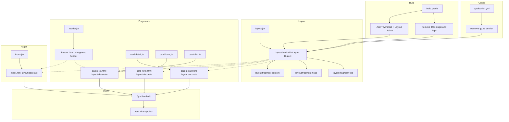

# План миграции JTE → Thymeleaf

## Обзор

Перевод всех шаблонов с JTE на Thymeleaf с сохранением всей логики: условные конструкции, циклы, подстановки переменных, макеты и фрагменты.

## Архитектура решения

### Зависимости (build.gradle)

- **Удалить:**
  - `id 'gg.jte.gradle' version '3.1.12'` (плагин)
  - `implementation 'gg.jte:jte-spring-boot-starter-3:3.1.12'`
  - `compileOnly 'gg.jte:jte:3.1.12'`
  - блок `jte { ... }`

- **Добавить:**
  - `implementation 'org.springframework.boot:spring-boot-starter-thymeleaf'`
  - `implementation 'nz.net.ultraq.thymeleaf:thymeleaf-layout-dialect'`

### Конфигурация (application.yml)

- **Удалить:**
  ```yaml
  gg:
    jte:
      use-mvc=true
      content-type:text=html
  ```

### Структура шаблонов

Новые Thymeleaf-шаблоны создаются в `src/main/resources/templates/`:

```
src/main/resources/templates/
├── layout.html              # Базовый макет (замена layout.jte)
├── index.html               # Лендинг (замена index.jte)
└── fragments/
    ├── header.html           # Фрагмент шапки (замена fragments/header.jte)
    ├── card-detail.html      # Деталь карточки (замена fragments/card-detail.jte)
    ├── card-form.html        # Форма карточки (замена fragments/card-form.jte)
    └── cards-list.html       # Список карточек (замена fragments/cards-list.jte)
```

Старые JTE-шаблоны в `src/main/resources/jte/` остаются нетронутыми (можно удалить после верификации).

### Маппинг JTE → Thymeleaf конструкций

| JTE | Thymeleaf | Пример (JTE → Thymeleaf) |
|-----|-----------|--------------------------|
| `${variable}` | `th:text="${variable}"` или `[[${variable}]]` | `${title}` → `[[${title}]]` |
| `@if(cond)` / `@endif` | `th:if="${cond}"` | `@if(successMessage != null)` → `th:if="${successMessage != null}"` |
| `@if(cond) ... @else` | `th:if` + `th:unless` | `@if(cards == null) ... @else` → два элемента с `th:if` и `th:unless` |
| `@for (var item : items)` / `@endfor` | `th:each="item : ${items}"` | `@for (var card : cards)` → `th:each="card : ${cards}"` |
| `@param Type name = default` | (не нужно — model-атрибуты) | `@param String title = "Word App"` → не нужно |
| `@template.layout(...)` | `layout:decorate="layout"` | Вызов layout'а с параметрами |
| `@template.fragments.header(...)` | `th:replace="fragments/header :: header"` | Вставка фрагмента |
| Content-блоки `` @`...` `` | `layout:fragment="content"` | Передача контента в layout |
| `@{value ?? default}` | `[[${value != null ? value : default}]]` | `@{query ?? ''}` → `[[${query != null ? query : ''}]]` |
| `${obj.method()}` | `${obj.method()}` или `${obj.property}` | `${card.getEnglishWord()}` → `${card.englishWord}` (через Lombok getter) |
| `@import` | (не нужно в HTML) | Импорты Java-классов не нужны |

## Пошаговый план выполнения

### Шаг 1: build.gradle — замена зависимостей JTE на Thymeleaf

**Файл:** [`build.gradle`](build.gradle)

Изменения:
1. Удалить строку `id 'gg.jte.gradle' version '3.1.12'` из секции `plugins`
2. Удалить `implementation 'gg.jte:jte-spring-boot-starter-3:3.1.12'`
3. Удалить `compileOnly 'gg.jte:jte:3.1.12'`
4. Добавить `implementation 'org.springframework.boot:spring-boot-starter-thymeleaf'`
5. Добавить `implementation 'nz.net.ultraq.thymeleaf:thymeleaf-layout-dialect'`
6. Удалить блок `jte { ... }` в конце файла

### Шаг 2: application.yml — удаление JTE-конфигурации

**Файл:** [`src/main/resources/application.yml`](src/main/resources/application.yml)

Изменения:
1. Удалить строки 49-52 (секция `gg.jte`)

### Шаг 3: Создать layout.html (Thymeleaf Layout Dialect)

**Файл:** `src/main/resources/templates/layout.html`

**JTE-оригинал:** [`src/main/resources/jte/layout.jte`](src/main/resources/jte/layout.jte)

Логика для конвертации:
- `@param String title = "Word App"` → не нужен, title передаётся через model или layout:fragment
- `@param gg.jte.Content head = null` → фрагмент `head` через `layout:fragment="head"`
- `@param gg.jte.Content content` → фрагмент `content` через `layout:fragment="content"`
- `${title}` → через `th:block` с `layout:fragment="title"` или атрибут
- `@if(head != null) ${head} @endif` → `th:if="${head}"` + `th:replace`

Рекомендуемая структура layout.html:
```html
<!DOCTYPE html>
<html lang="en" xmlns:th="http://www.thymeleaf.org"
      xmlns:layout="http://www.ultraq.net.nz/thymeleaf/layout">
<head>
    <meta charset="UTF-8">
    <meta name="viewport" content="width=device-width, initial-scale=1.0">
    <title layout:fragment="title">Word App</title>
    <link rel="stylesheet" href="/css/common.css">
    <th:block layout:fragment="head" />
</head>
<body>
    <th:block layout:fragment="content" />
</body>
</html>
```

### Шаг 4: Создать fragments/header.html

**Файл:** `src/main/resources/templates/fragments/header.html`

**JTE-оригинал:** [`src/main/resources/jte/fragments/header.jte`](src/main/resources/jte/fragments/header.jte)

Логика конвертации:
- `@param` → атрибуты передаются через `th:replace` как параметры
- `${title}` → `[[${title}]]`
- `@if(subtitle != null) { ... } @endif` → `th:if="${subtitle != null}"`
- Определить `th:fragment="header(title, subtitle)"`

### Шаг 5: Создать fragments/card-detail.html

**Файл:** `src/main/resources/templates/fragments/card-detail.html`

**JTE-оригинал:** [`src/main/resources/jte/fragments/card-detail.jte`](src/main/resources/jte/fragments/card-detail.jte)

Логика конвертации:
- `@param WordCard card` → модель уже содержит `card` (из контроллера)
- `@template.layout(...)` → `layout:decorate="layout"`
- Content-блок → `layout:fragment="content"`
- Head-блок → `layout:fragment="head"`
- `${card.getEnglishWord()}` → `[[${card.englishWord}]]` (Lombok-геттер)
- `@if(card.getExample() != null && !card.getExample().isEmpty())` → `th:if="${card.example != null and !card.example.isEmpty()}"`
- `${card.getDifficultyLevel()}` → `[[${card.difficultyLevel}]]`
- URL `/cards/${card.getId()}` → `th:href="@{/cards/{id}(id=${card.id})}"` или `/cards/[[${card.id}]]`

### Шаг 6: Создать fragments/cards-list.html

**Файл:** `src/main/resources/templates/fragments/cards-list.html`

**JTE-оригинал:** [`src/main/resources/jte/fragments/cards-list.jte`](src/main/resources/jte/fragments/cards-list.jte)

Логика конвертации:
- `@import` → не нужны
- `@template.fragments.header(...)` → `th:replace="fragments/header :: header"`
- `@if(successMessage != null)` → `th:if="${successMessage != null}"`
- `@{query ?? ''}` → `th:value="*{query != null ? query : ''}"` или `[[${query != null ? query : ''}]]`
- `@if(cards == null || cards.isEmpty())` → `th:if="${cards == null or cards.isEmpty()}"`
- `@else` → `th:unless="${cards == null or cards.isEmpty()}"`
- `@for (var card : cards)` → `th:each="card : ${cards}"`
- `@if(card.getExample() != null && !card.getExample().isEmpty())` → `th:if="${card.example != null and !card.example.isEmpty()}"`

### Шаг 7: Создать fragments/card-form.html

**Файл:** `src/main/resources/templates/fragments/card-form.html`

**JTE-оригинал:** [`src/main/resources/jte/fragments/card-form.jte`](src/main/resources/jte/fragments/card-form.jte)

Логика конвертации:
- `@import` → не нужны
- Тернарник `wordCard.getId() != null ? "Edit" : "Add"` → `[[${wordCard.id != null ? 'Edit' : 'Add'}]]`
- `${StringUtil.getOrEmpty(...)}` → Thymeleaf `#strings.defaultString(...)` или Elvis-оператор `${... ?: ''}`
- `@if(errors != null && errors.hasFieldErrors("englishWord"))` → `th:if="${errors != null and errors.hasFieldErrors('englishWord')}"`
- `${errors.getFieldError("englishWord").getDefaultMessage()}` → `[[${errors.getFieldError('englishWord').defaultMessage}]]`
- `selected="${wordCard.isSelected(...)}"` → `th:selected="${wordCard.isSelected(...)}"` (флаг boolean)
- URL action: тернарник для action формы
- `th:object="${wordCard}"` для удобной работы с полями формы

### Шаг 8: Создать index.html

**Файл:** `src/main/resources/templates/index.html`

**JTE-оригинал:** [`src/main/resources/jte/index.jte`](src/main/resources/jte/index.jte)

Логика конвертации:
- Текущий `index.jte` имеет закомментированный layout + заглушку. Нужно создать полноценную страницу, аналогичную закомментированной версии, но на Thymeleaf.
- Использовать `layout:decorate="layout"`
- Включить фрагмент `header` через `th:replace`

### Шаг 9: (Опционально) Удалить старые JTE-шаблоны

После верификации, что Thymeleaf-версии работают корректно:
1. Удалить `src/main/resources/jte/` целиком

### Шаг 10: Проверка и сборка

1. Выполнить `./gradlew build` для проверки успешной компиляции
2. Запустить приложение и проверить все страницы:
   - `GET /cards` — список карточек
   - `GET /cards/new` — форма создания
   - `GET /cards/1` — деталь карточки
   - `GET /cards/random` — случайная карточка
   - `GET /cards/search?query=word` — поиск
   - `GET /cards/1/edit` — форма редактирования
   - `POST /cards` — создание (с валидацией)
   - `POST /cards/1` — обновление (с валидацией)

## Диаграмма потока конвертации



## Основные синтаксические отличия (шпаргалка)

### Условные операторы
```html
<!-- JTE -->
@if(cards == null || cards.isEmpty())
    <p>No cards</p>
@else
    <p>Cards exist</p>
@endif

<!-- Thymeleaf -->
<div th:if="${cards == null or cards.isEmpty()}">
    <p>No cards</p>
</div>
<div th:unless="${cards == null or cards.isEmpty()}">
    <p>Cards exist</p>
</div>
```

### Циклы
```html
<!-- JTE -->
@for (var card : cards)
    <div>${card.getEnglishWord()}</div>
@endfor

<!-- Thymeleaf -->
<div th:each="card : ${cards}">
    <div th:text="${card.englishWord}">Word</div>
</div>
```

### Включение фрагментов
```html
<!-- JTE: @template.fragments.header(title = "...", subtitle = "...") -->
<!-- Thymeleaf: -->
<div th:replace="fragments/header :: header(title='...', subtitle='...')"></div>
```

### Макеты (Layout Dialect)
```html
<!-- JTE: @template.layout(title = "...", content = @`...`) -->
<!-- Thymeleaf (в дочернем шаблоне): -->
<html layout:decorate="layout">
    <title layout:fragment="title">Page Title</title>
    <th:block layout:fragment="content">
        <!-- контент -->
    </th:block>
</html>
```

### URL с переменными
```html
<!-- JTE --> <a href="/cards/${card.getId()}">View</a>
<!-- Thymeleaf --> <a th:href="@{/cards/{id}(id=${card.id})}">View</a>
<!-- или --> <a th:href="|/cards/${card.id}|">View</a>
```

### Подстановка значений (inline)
```html
<!-- JTE --> <h2>${card.getEnglishWord()}</h2>
<!-- Thymeleaf --> <h2 th:text="${card.englishWord}">Word</h2>
<!-- или --> <h2>[[${card.englishWord}]]</h2>
```
