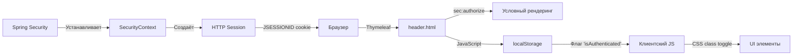
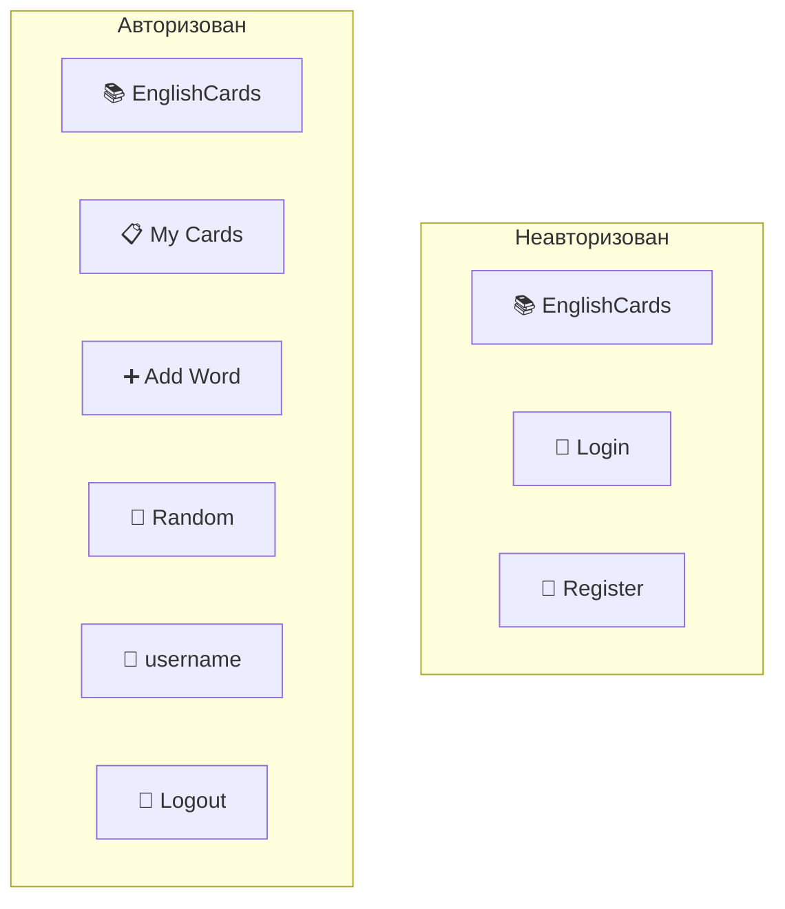

# План реализации: страницы входа (login), регистрации (register) и обновление навигации

## 1. Контекст и текущее состояние

**Текущая архитектура аутентификации:**
- Spring Security с JWT-фильтром (`JwtAuthenticationFilter`) для REST API (`/api/**`)
- Form login (стандартная страница Spring Security по умолчанию)
- OAuth2 login через Google (уже настроен в [`application.yml`](../../src/main/resources/application.yml:23))
- Пользовательская модель [`User.java`](../../src/main/java/com/example/englishwordsapp/security/User.java) в пакете `security`
- [`SecurityConfig.java`](../../src/main/java/com/example/englishwordsapp/config/SecurityConfig.java) настраивает цепочку фильтров
- [`AuthController.java`](../../src/main/java/com/example/englishwordsapp/controller/AuthController.java) — REST endpoint `/api/auth/login` для JWT
- [`CustomOAuth2UserService.java`](../../src/main/java/com/example/englishwordsapp/security/CustomOAuth2UserService.java) обрабатывает OAuth2-пользователей (только Google)

**Текущая навигация:**
- [`header.html`](../../src/main/resources/templates/fragments/header.html) — фрагмент навигации, уже использует `sec:authorize="isAuthenticated()"` для скрытия ссылок
- Нет кнопки выхода (logout) и ссылок на вход/регистрацию для неавторизованных пользователей

## 2. Требования (согласовано)

- ✅ **Основной тип аутентификации**: Form login (сессионный, Thymeleaf). JWT — только для REST API.
- ✅ **Кастомная страница входа**: `/login` с обработкой ошибок (неверные данные, пустые поля)
- ✅ **Страница регистрации**: `/register` с формой создания нового пользователя
- ✅ **OAuth2**: Только Google (уже настроен)
- ✅ **Язык**: Английский
- ✅ **Перенаправление после входа**: На `/cards`
- ✅ **Navbar**: Условное отображение:
  - Неавторизован: ссылки "Login" и "Register"
  - Авторизован: кнопка "Logout" (POST `/logout`), приветствие пользователя
- ✅ **localStorage**: Использовать для хранения состояния аутентификации (фронтенд)

## 3. Архитектура решения

```mermaid
flowchart TB
    subgraph "Пользователь (неавторизован)"
        A[GET /] --> B{Есть сессия?}
        B -->|Нет| C[Показать index.html с hero]
        B -->|Да| D[Показать index.html с карточками]
        C --> E[Навигация: Login | Register]
    end

    subgraph "Страница входа"
        F[GET /login] --> G[login.html]
        G --> H[POST /login]
        H --> I{Успех?}
        I -->|Да| J[Redirect /cards]
        I -->|Нет| K[/login?error=true]
        K --> G
        G --> L[Google OAuth2]
        L --> M[/oauth2/authorization/google]
        M --> N[Redirect /cards]
    end

    subgraph "Страница регистрации"
        O[GET /register] --> P[register.html]
        P --> Q[POST /register]
        Q --> R{Валидация?}
        R -->|Ошибка| P
        R -->|Успех| S[Redirect /login?registered]
    registered]
    end

    subgraph "Navbar (header.html)"
        T[Navbar] --> U{isAuthenticated?}
        U -->|Да| V[My Cards | Add Word | Random | User name | Logout]
        U -->|Нет| W[Login | Register]
    end

    subgraph "Выход"
        X[POST /logout] --> Y[Очистка сессии]
        Y --> Z[Redirect /login?logout]
    end
```

## 4. Поток данных для хранения состояния аутентификации



## 5. Изменяемые и создаваемые файлы

### 5.1 Новые файлы

| Файл | Назначение |
|------|-----------|
| [`src/main/resources/templates/login.html`](../../src/main/resources/templates/login.html) | Страница входа с формой, OAuth2 кнопкой, обработкой ошибок |
| [`src/main/resources/templates/register.html`](../../src/main/resources/templates/register.html) | Страница регистрации с формой и валидацией |

### 5.2 Изменяемые файлы

| Файл | Изменения |
|------|-----------|
| [`src/main/java/com/example/englishwordsapp/config/SecurityConfig.java`](../../src/main/java/com/example/englishwordsapp/config/SecurityConfig.java) | Настроить `.formLogin()` на кастомную страницу; добавить `/register` в `permitAll()`; добавить `loginPage`, `loginProcessingUrl`, `failureUrl`, `defaultSuccessUrl` |
| [`src/main/java/com/example/englishwordsapp/controller/AuthController.java`](../../src/main/java/com/example/englishwordsapp/controller/AuthController.java) | Добавить `GET /login` (Thymeleaf), `GET /register`, `POST /register` с валидацией, `GET /login?error`, `GET /login?logout`, `GET /login?registered` |
| [`src/main/java/com/example/englishwordsapp/security/CustomUserDetailsService.java`](../../src/main/java/com/example/englishwordsapp/security/CustomUserDetailsService.java) | Добавить метод `registerUser()` для создания нового пользователя |
| [`src/main/resources/templates/fragments/header.html`](../../src/main/resources/templates/fragments/header.html) | Добавить условное отображение: login/register для неавторизованных; logout + username для авторизованных |
| [`src/main/resources/static/css/main.css`](../../src/main/resources/static/css/main.css) | Добавить стили для страниц входа/регистрации (login-page, auth-form, oauth-button, error-box, alert) |
| [`build.gradle`](../../build.gradle) | Добавить зависимость `thymeleaf-extras-springsecurity6` (если отсутствует) |

## 6. Детальный план реализации

### Шаг 1: Настроить `SecurityConfig.java`
**Файл:** [`src/main/java/com/example/englishwordsapp/config/SecurityConfig.java`](../../src/main/java/com/example/englishwordsapp/config/SecurityConfig.java:53)

Изменения:
- В `.authorizeHttpRequests()` добавить `.requestMatchers("/register").permitAll()`
- Добавить `.requestMatchers("/css/**", "/js/**", "/images/**").permitAll()` (статические ресурсы)
- В `.formLogin()` настроить:
  - `.loginPage("/login")` — кастомная страница
  - `.loginProcessingUrl("/login")` — POST endpoint для Spring Security
  - `.defaultSuccessUrl("/cards", true)` — редирект после успеха
  - `.failureUrl("/login?error=true")` — редирект при ошибке
- В `.logout()` настроить:
  - `.logoutUrl("/logout")`
  - `.logoutSuccessUrl("/login?logout=true")`
  - `.deleteCookies("JSESSIONID")`
  - `.invalidateHttpSession(true)`

### Шаг 2: Создать `AuthController.java` (Thymeleaf endpoints)
**Файл:** [`src/main/java/com/example/englishwordsapp/controller/AuthController.java`](../../src/mainjava/com/example/englishwordsapp/controller/AuthController.java)

Добавить Thymeleaf-контроллер (или дополнить существующий REST-контроллер):
- `GET /login` — возвращает `login.html`
  - Принимает параметры: `error`, `logout`, `registered`
  - Передает в модель флаги: `error`, `logout`, `registered`
- `GET /register` — возвращает `register.html`
  - Передает пустой `user` объект в модель
- `POST /register` — обрабатывает регистрацию
  - Принимает: `username`, `email`, `password`, `confirmPassword`
  - Валидация: поля не пустые, password совпадает с confirmPassword, username/email уникальны
  - При ошибке: возвращает `register.html` с сообщениями об ошибках
  - При успехе: создаёт пользователя (BCrypt), редирект на `/login?registered`

### Шаг 3: Создать `login.html`
**Файл:** [`src/main/resources/templates/login.html`](../../src/main/resources/templates/login.html)

Структура:
- Использует `layout:decorate="layout"`
- Фрагмент `title`: "Login — English Words App"
- Фрагмент `content`:
  - **Контейнер** `.auth-container` (центрированный, max-width 420px)
  - **Заголовок**: "Welcome Back" или "Sign In"
  - **Alert-сообщения**:
    - `th:if="${param.error}"`: "Invalid username or password."
    - `th:if="${param.logout}"`: "You have been logged out."
    - `th:if="${param.registered}"`: "Account created! Please sign in."
  - **Форма** (POST `/login`):
    - Поле username (email)
    - Поле password
    - Кнопка "Sign In"
    - CSRF-токен (автоматически через Spring Security)
  - **OAuth2-секция**:
    - Разделитель "or continue with"
    - Кнопка "Continue with Google" → `/oauth2/authorization/google`
    - Иконка Google
  - **Ссылка**: "Don't have an account? Register"

### Шаг 4: Создать `register.html`
**Файл:** [`src/main/resources/templates/register.html`](../../src/main/resources/templates/register.html)

Структура:
- Использует `layout:decorate="layout"`
- Фрагмент `title`: "Register — English Words App"
- Фрагмент `content`:
  - **Контейнер** `.auth-container`
  - **Заголовок**: "Create Account"
  - **Форма** (POST `/register`):
    - Поле username (с валидацией)
    - Поле email
    - Поле password
    - Поле confirm password
    - Кнопка "Create Account"
    - CSRF-токен
  - **Ошибки валидации**:
    - Empty fields
    - Password mismatch
    - Username/email already taken
  - **Ссылка**: "Already have an account? Sign in"

### Шаг 5: Обновить `header.html` (Navbar)
**Файл:** [`src/main/resources/templates/fragments/header.html`](../../src/main/resources/templates/fragments/header.html)

Изменения:
- Добавить `xmlns:sec="http://www.thymeleaf.org/extras/spring-security"`
- **Секция для неавторизованных** (`sec:authorize="!isAuthenticated()"`):
  - Ссылка "🔑 Login" → `/login`
  - Ссылка "📝 Register" → `/register`
- **Секция для авторизованных** (`sec:authorize="isAuthenticated()"`):
  - Отобразить имя пользователя: `sec:authentication="name"`
  - Кнопка "🚪 Logout" (POST форма `/logout` с CSRF-токеном)
- Существующие ссылки (My Cards, Add Word, Random) — только для авторизованных

### Шаг 6: Добавить CSS для страниц входа/регистрации
**Файл:** [`src/main/resources/static/css/main.css`](../../src/main/resources/static/css/main.css)

Добавить стили:
- `.auth-page` — центрирование контейнера
- `.auth-container` — карточка с тенью
- `.auth-header` — заголовок и подзаголовок
- `.auth-form` — стили формы
- `.auth-divider` — разделитель "or continue with"
- `.oauth-btn` — кнопка OAuth2 провайдера
- `.oauth-btn-google` — Google-специфичные стили
- `.auth-footer` — ссылка внизу
- `.alert` — уже есть, убедиться что используется
- `.auth-error` — блок ошибки для формы регистрации

### Шаг 7: Добавить/проверить зависимость Thymeleaf Spring Security
**Файл:** [`build.gradle`](../../build.gradle)

- Добавить (если отсутствует):
  ```groovy
  implementation 'org.thymeleaf.extras:thymeleaf-extras-springsecurity6'
  ```
  (версия управляется Spring Boot BOM)

### Шаг 8: JavaScript для localStorage (флага аутентификации
**Файл:** [`src/main/resources/templates/layout.html`](../../src/main/resources/templates/layout.html)

Добавить скрипт в конец `<body>`:
- Проверять наличие meta-тега с состоянием аутентификации (можно передавать через Thymeleaf)
- Сохранять флаг `isAuthenticated` в localStorage
- При logout — очищать localStorage

Можно передавать состояние через Thymeleaf:
```html
<script th:inline="javascript">
    /*<![CDATA[*/
    const isAuthenticated = /*[[${#authentication != null && #authentication.isAuthenticated()}]]*/ false;
    localStorage.setItem('isAuthenticated', isAuthenticated);
    /*]]>*/
</script>
```

### Шаг 9: Настроить `WordCardController` для редиректа на /login
**Файл:** [`src/main/java/com/example/englishwordsapp/controller/WordCardController.java`](../../src/main/java/com/example/englishwordsapp/controller/WordCardController.java)

- Уже использует `return "redirect:/login"` при `userDetails == null` — оставить как есть
- Spring Security теперь будет обрабатывать `/login` через кастомную страницу

### Шаг 10: Проверить существование и работу миграций для таблицы users
- Убедиаграмма изменений в `db.changelog-master.yaml` для таблицы `users` уже существует
- Проверить наличие Liquibase changeset для таблиц `users`, `roles`, `user_roles`

## 7. Обработка ошибок

| Сценарий | Страница | Поведение |
|----------|----------|-----------|
| Пустые поля при входе | `/login?error=true` | Alert "Invalid username or password." |
| Неверные данные | `/login?error=true` | Alert "Invalid username or password." |
| Пустые поля при регистрации | `/register` | Показать сообщения под каждым полем |
| Пароли не совпадают | `/register` | Ошибка "Passwords do not match" |
| Username/email занят | `/register` | Ошибка "Username/email already in use" |
| Успешная регистрация | `/login?registered` | Alert "Account created! Please sign in." |
| Выход из системы | `/login?logout` | Alert "You have been logged out." |

## 8. Navbar — конечное состояние



## 9. UX/UI макет страницы входа

```
┌──────────────────────────────────────┐
│            (navbar)                    │
├──────────────────────────────────────┤
│                                      │
│       ┌──────────────────────┐       │
│       │   Welcome Back       │       │
│       │                      │       │
│       │  ⚠️ Invalid creds   │       │  ← alert (если error)
│       │                      │       │
│       │  Username            │       │
│       │  ┌────────────────┐  │       │
│       │  │                │  │       │
│       │  └────────────────┘  │       │
│       │                      │       │
│       │  Password            │       │
│       │  ┌────────────────┐  │       │
│       │  │                │  │       │
│       │  └────────────────┘  │       │
│       │                      │       │
│       │  [Sign In]           │       │
│       │                      │       │
│       │  ── or continue ──   │       │
│       │                      │       │
│       │  [G  Continue with Google]  │
│       │                      │       │
│       │  Don't have account? │       │
│       │  Register            │       │
│       └──────────────────────┘       │
│                                      │
└──────────────────────────────────────┘