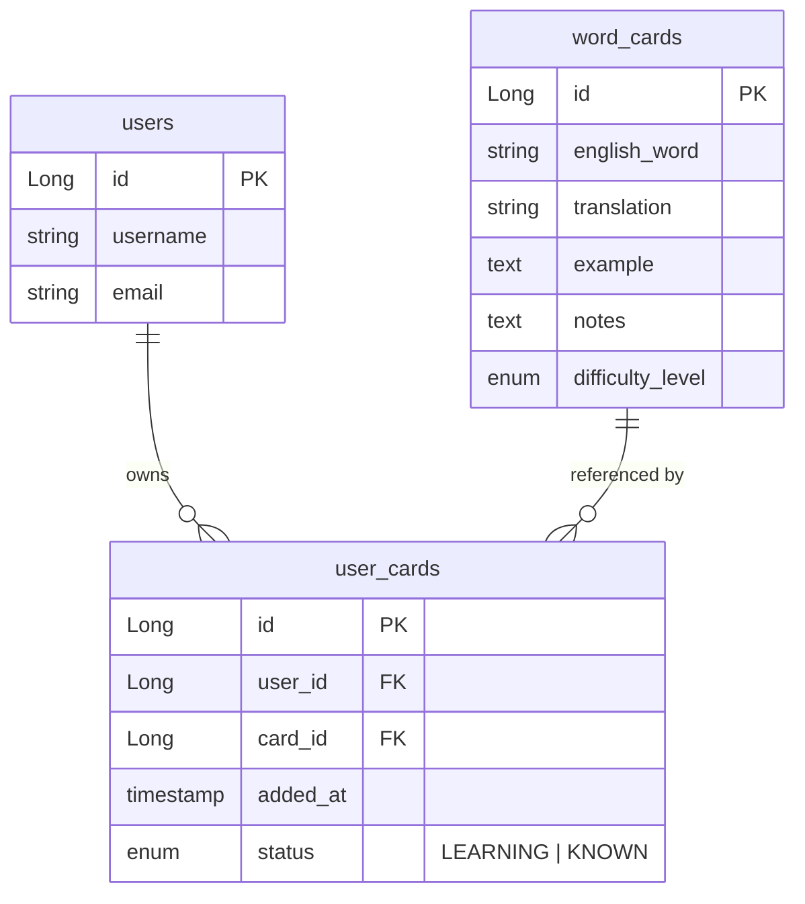
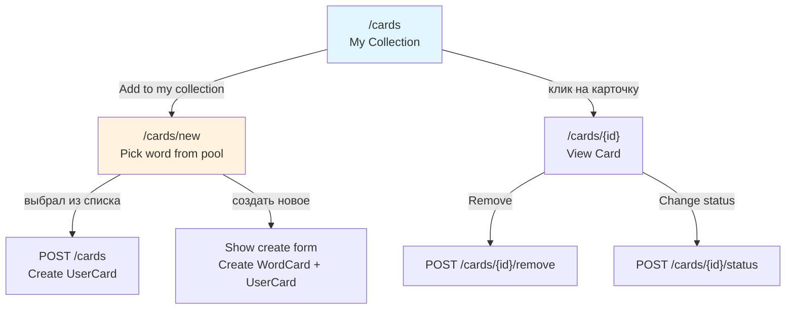

# План: Персональные коллекции слов для пользователей

## Описание задачи

Каждый пользователь может выбирать слова из общего пула и добавлять их в свою персональную коллекцию для изучения. У каждого пользователя — свой персональный список слов с отслеживанием прогресса изучения.

## Ключевые требования (уточнённые)

1. **Общий пул слов (~10000 слов)** — загружается через data-migration скрипт
2. **Слово остаётся в общем пуле** — может быть выбрано несколькими пользователями независимо
3. **Общий пул не отображается отдельной страницей** — слова из пула выбираются через **выпадающий список (+ поиск)** при добавлении в коллекцию, чтобы избежать дубликатов
4. **Статус изучения** — у каждого слова в коллекции пользователя есть статус (LEARNING, KNOWN), дата добавления
5. **Главная страница (`/cards`)** — показывает только слова пользователя
6. **Создание карточки (`/cards/new`)** — теперь это добавление слова из пула в свою коллекцию. Выпадающий список существующих слов + опция создать новое слово, если его нет в пуле

## Текущая архитектура

- [`WordCard`](src/main/java/com/example/englishwordsapp/model/WordCard.java) — карточка слова, общая для всех
- [`User`](src/main/java/com/example/englishwordsapp/security/User.java) — пользователь
- Нет связи между User и WordCard — все видят все карточки
- [`WordCardService`](src/main/java/com/example/englishwordsapp/service/WordCardService.java) — CRUD сервис
- [`WordCardController`](src/main/java/com/example/englishwordsapp/controller/WordCardController.java) — Thymeleaf контроллер
- [`WordCardRestController`](src/main/java/com/example/englishwordsapp/controller/WordCardRestController.java) — REST API

## Модель данных

### Новая сущность: UserCard

Пакет: `com.example.englishwordsapp.model`

```java
@Entity
@Table(name = "user_cards", uniqueConstraints = @UniqueConstraint(columnNames = {"user_id", "card_id"}))
public class UserCard {
    @Id @GeneratedValue(strategy = GenerationType.IDENTITY)
    private Long id;

    @ManyToOne(fetch = FetchType.LAZY)
    @JoinColumn(name = "user_id", nullable = false)
    private User user;

    @ManyToOne(fetch = FetchType.LAZY)
    @JoinColumn(name = "card_id", nullable = false)
    private WordCard wordCard;

    @Column(name = "added_at", nullable = false)
    private LocalDateTime addedAt;

    @Enumerated(EnumType.STRING)
    @Column(nullable = false)
    private StudyStatus status = StudyStatus.LEARNING;

    public enum StudyStatus {
        LEARNING,
        KNOWN
    }
}
```

### ER-диаграмма



## Изменения по слоям

### 1. Модель
- Создать [`UserCard.java`](src/main/java/com/example/englishwordsapp/model/UserCard.java)
- Добавить enum `StudyStatus { LEARNING, KNOWN }`

### 2. Репозиторий
- Создать [`UserCardRepository.java`](src/main/java/com/example/englishwordsapp/repository/UserCardRepository.java):
  - `List<UserCard> findByUserId(Long userId)`
  - `Optional<UserCard> findByUserIdAndCardId(Long userId, Long cardId)`
  - `boolean existsByUserIdAndCardId(Long userId, Long cardId)`
  - `void deleteByUserIdAndCardId(Long userId, Long cardId)`
  - `List<Long> findCardIdsByUserId(Long userId)` — @Query для проекции
  - `List<UserCard> findByUserIdAndStatus(Long userId, StudyStatus status)`

### 3. Сервис
- Обновить [`WordCardService.java`](src/main/java/com/example/englishwordsapp/service/WordCardService.java):
  - Инжектировать `UserCardRepository`
  - Методы:
    - `addCardToUserCollection(Long userId, Long cardId)` — добавить слово в коллекцию пользователя
    - `removeCardFromUserCollection(Long userId, Long cardId)` — убрать слово
    - `getUserCards(Long userId)` — все слова пользователя с UserCard метаданными
    - `getUserCardIds(Long userId)` — Set<Long> ID слов пользователя
    - `updateStudyStatus(Long userId, Long cardId, StudyStatus status)` — обновить статус
    - `searchInGlobalPool(String query)` — поиск в общем пуле (для выпадающего списка)

### 4. Thymeleaf контроллер (WordCardController)
- **`GET /cards`** — показывает только слова текущего пользователя (через `getUserCards`)
  - Если не аутентифицирован → редирект на `/oauth2/authorization/google` или `/login`
- **`GET /cards/new`** — форма добавления слова:
  - Выпадающий список из общего пула (с поиском по мере ввода)
  - Опция "Create new word" если слово не найдено
  - Отправляет `POST /cards` с card_id из списка
- **`POST /cards`** — теперь добавляет выбранное слово в коллекцию пользователя (create UserCard)
  - Если выбрано новое слово → создать WordCard + UserCard
- **`POST /cards/{id}/add`** — добавить существующее слово в коллекцию
- **`POST /cards/{id}/remove`** — убрать из коллекции
- **`POST /cards/{id}/status`** — обновить статус изучения
- **`GET /cards/search-global`** — JSON эндпоинт для поиска в общем пуле (autocomplete)

### 5. REST API (WordCardRestController)
- **`GET /api/cards/my`** — мои слова (authenticated)
- **`POST /api/cards/{id}/add-to-collection`** — добавить в коллекцию
- **`DELETE /api/cards/{id}/remove-from-collection`** — убрать
- **`PUT /api/cards/{id}/study-status`** — изменить статус изучения
- **`GET /api/cards/search-global?query=`** — поиск в общем пуле

### 6. Шаблоны

#### header.html
- "📋 My Cards" → `/cards` (только для авторизованных, подсвечен активным)
- "➕ Add to my collection" → `/cards/new`

#### index.html
- На главной: список слов пользователя
- У каждого слова: кнопка "Remove from my collection", статус изучения
- Если коллекция пуста: сообщение "Add some words to start learning!" и ссылка на `/cards/new`

#### card-form.html (полная переработка)
- Поле поиска по общему пулу + выпадающий список результатов
- Кнопка "➕ Create new word" — раскрывает форму создания нового WordCard
- Отправка формы создаёт UserCard (а не новый WordCard)

#### card-detail.html
- Кнопка "Remove from my collection"
- Переключатель статуса "Learning" / "Known"
- Ссылка "🎲 Next Random" — случайное слово из коллекции пользователя

### 7. SecurityConfig
- `/cards/new` — authenticated
- `/cards/{id}/add`, `/cards/{id}/remove`, `/cards/{id}/status` — authenticated
- `/cards/search-global` — authenticated
- `/api/cards/my`, `/api/cards/search-global` — authenticated
- POST/PUT/DELETE на `/api/cards/**` — authenticated

### 8. Миграции БД (Liquibase)

- Добавить зависимость `liquibase-core` в build.gradle
- Добавить Liquibase changelog master-файл: `db/changelog/db.changelog-master.yaml`

#### Changelog 1: создание таблицы user_cards
```sql
CREATE TABLE user_cards (
    id BIGSERIAL PRIMARY KEY,
    user_id BIGINT NOT NULL REFERENCES users(id),
    card_id BIGINT NOT NULL REFERENCES word_cards(id),
    added_at TIMESTAMP NOT NULL DEFAULT NOW(),
    status VARCHAR(20) NOT NULL DEFAULT 'LEARNING',
    UNIQUE(user_id, card_id)
);
```

#### Data migration: загрузка словаря
- Создать SQL скрипт с INSERT ~10000 слов в `word_cards`
- Использовать файл `data/english-words.csv` или встроенный SQL


## Диаграмма навигации



## Порядок реализации

1. **Модель + репозиторий**: UserCard, UserCardRepository
2. **Миграции БД**: user_cards table + словарь 10000 слов
3. **Сервис**: WordCardService — новые методы
4. **Thymeleaf контроллер**: обновление WordCardController
5. **Шаблоны**: index.html, card-form.html, card-detail.html, header.html
6. **REST API**: WordCardRestController — новые эндпоинты
7. **Security**: SecurityConfig