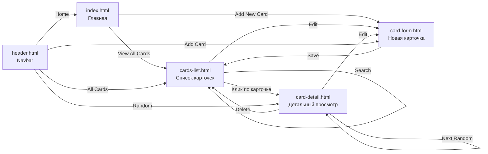

# План редизайна UI — English Words App

## Цель
Переписать UI приложения в современном минималистичном светлом стиле, напоминающем современные образовательные приложения (Duolingo, Quizlet, Memrise).

## Текущие проблемы
1. **Градиентный фон** (фиолетовый `#667eea → #764ba2`) — выглядит устаревшим
2. **Дублирование CSS** — каждый файл содержит полный сброс и базовые стили (body, container, header, .btn)
3. **Inline-стили** на главной странице (`style="text-align:center; padding:60px..."`)
4. **Нет дизайн-системы** — цвета, тени, отступы не централизованы
5. **Нет микро-анимаций** и современных визуальных эффектов
6. **Простая навигация** — нет нормального navbar/header

---

## Дизайн-система

### Цветовая палитра

```css
--color-bg: #f8fafc              /* светло-серый фон страницы */
--color-surface: #ffffff         /* белый фон карточек */
--color-surface-hover: #f1f5f9  /* hover для карточек */
--color-border: #e2e8f0         /* тонкие границы */
--color-text-primary: #0f172a   /* основной текст (slate-900) */
--color-text-secondary: #64748b /* второстепенный текст (slate-500) */
--color-text-muted: #94a3b8     /* muted текст (slate-400) */
--color-accent: #4f46e5         /* акцентный индиго */
--color-accent-hover: #4338ca   /* hover акцента */
--color-accent-light: #eef2ff   /* легкий фон для акцента */
--color-success: #10b981        /* зеленый для BEGINNER */
--color-warning: #f59e0b        /* желтый для INTERMEDIATE */
--color-danger: #ef4444         /* красный для ADVANCED / удаления */
```

### Типографика
- **Шрифт:** Inter (Google Fonts)
- **Размеры:**
  - `h1`: 2rem / 700 / заголовок страницы
  - `h2`: 1.5rem / 600 / подзаголовки
  - `h3`: 1.125rem / 600 / заголовки карточек
  - `body`: 0.9375rem / 400 / основной текст
  - `small`: 0.8125rem / 400 / вспомогательный текст
  - `badge`: 0.75rem / 600 / бейджи сложности

### Тени
```css
--shadow-sm: 0 1px 3px rgba(0,0,0,0.06), 0 1px 2px rgba(0,0,0,0.04)
--shadow-md: 0 4px 6px -1px rgba(0,0,0,0.07), 0 2px 4px -2px rgba(0,0,0,0.05)
--shadow-lg: 0 10px 15px -3px rgba(0,0,0,0.08), 0 4px 6px -4px rgba(0,0,0,0.04)
--shadow-card: 0 1px 3px rgba(0,0,0,0.06), 0 1px 2px rgba(0,0,0,0.04)
--shadow-card-hover: 0 10px 15px -3px rgba(0,0,0,0.08), 0 4px 6px -4px rgba(0,0,0,0.04)
```

### Скругления
```css
--radius-sm: 6px    /* кнопки, инпуты */
--radius-md: 10px   /* карточки, блоки */
--radius-lg: 16px   /* модальные окна, крупные блоки */
--radius-full: 9999px /* бейджи, аватарки */
```

---

## Архитектура компонентов

### 1. `main.css` — единый файл стилей (новый)
\`src/main/resources/static/css/main.css\`

Содержит:
- CSS-переменные дизайн-системы
- Сброс (normalize)
- Базовые стили (body, контейнеры)
- Система кнопок (btn, btn-primary, btn-secondary, btn-danger, btn-ghost)
- Формы (label, input, textarea, select, form-group, form-actions, error-message)
- Карточки флеш-карт (flashcard, flashcard-inner для 3D flip)
- Difficulty badges
- Сетка карточек (cards-grid, card-item)
- Навигация (navbar)
- Утилиты (container, spacing helpers)
- Анимации (fade-in, slide-up, card-hover, flip)
- Responsive media queries
- Успешные сообщения (success-message, alert)
- Empty state

### 2. `layout.html` — базовый шаблон (изменение)
- Подключение Google Fonts (Inter)
- Подключение единого `main.css`
- Минимальная чистая разметка

### 3. `header.html` — навигация (изменение)
- Современный navbar с логотипом/названием слева
- Ссылки навигации справа (All Cards, Add Card, Random)
- Акцент при наведении
- Sticky header
- Mobile-friendly

### 4. `index.html` — главная страница (изменение)
- Hero-секция с заголовком и описанием
- Две CTA-кнопки (View All Cards, Add New Card)
- Чистая верстка без inline-стилей
- Иконки через Unicode эмодзи

### 5. `cards-list.html` — список карточек (изменение)
- Поиск с иконкой
- Сетка карточек с hover-эффектом (поднимаются, тень)
- Difficulty badges с цветовой индикацией
- Обрезка длинного текста (line-clamp)
- Анимация появления карточек

### 6. `card-detail.html` — детальный просмотр (изменение)
- Флешкарта с 3D flip анимацией
- Спереди: английское слово + difficulty badge
- Сзади: перевод, пример, заметки
- Красивые кнопки действий

### 7. `card-form.html` — форма создания/редактирования (изменение)
- Чистая форма с focus-эффектами
- Placeholders с подсказками
- Валидация с цветовой индикацией
- Разделение на логические секции

---

## Потоки данных и навигация



---

## Пошаговый план реализации

### Шаг 1: Создать `main.css`
- Определить CSS-переменные
- Написать все компонентные стили
- Добавить анимации
- Responsive-адаптация

### Шаг 2: Обновить `layout.html`
- Google Fonts (Inter: wght@400;500;600;700)
- Подключение `/css/main.css`
- Минимальная базовая структура

### Шаг 3: Редизайн `header.html`
- Flexbox navbar
- Лого + название слева
- Ссылки справа
- Адаптивность

### Шаг 4: Редизайн `index.html`
- Hero-секция
- Две CTA-кнопки
- Никаких inline-стилей

### Шаг 5: Редизайн `cards-list.html`
- Форма поиска
- Сетка карточек
- Difficulty badges
- Empty state
- Сообщение об успехе

### Шаг 6: Редизайн `card-detail.html`
- Флешкарта с 3D flip
- Передняя/задняя сторона
- Кнопки действий
- Difficulty badge на видном месте

### Шаг 7: Редизайн `card-form.html`
- Форма с улучшенными полями
- Валидация
- Placeholders
- Красивые кнопки

### Шаг 8: Удалить старые CSS
- common.css
- cards-list.css
- card-detail.css
- card-form.css

---

## Схема страниц после редизайна

### Главная (index.html)
```
┌──────────────────────────────────────┐
│  📚 EnglishCards    All Cards | +Add  │  ← navbar
├──────────────────────────────────────┤
│                                      │
│       📚 English Words App            │
│  Master English vocabulary with       │
│  personalized flashcards              │
│                                      │
│  [View All Cards]  [+ Add New Card]  │  ← CTA-кнопки
│                                      │
└──────────────────────────────────────┘
```

### Список карточек (cards-list.html)
```
┌──────────────────────────────────────┐
│  📚 EnglishCards    All Cards | +Add  │
├──────────────────────────────────────┤
│  🔍  [Search for words...] [Search]  │
│                                      │
│  ┌──────────┐  ┌──────────┐          │
│  │ Hello    │  │ Book     │          │
│  │ Привет   │  │ Книга    │          │
│  │ [BEGINNER]│  │[INTERMED]│          │
│  │ [View|Edit]│  │ [View|Edit]│       │
│  └──────────┘  └──────────┘          │
│                                      │
│  ┌──────────┐  ┌──────────┐          │
│  │ ...      │  │ ...      │          │
│  └──────────┘  └──────────┘          │
└──────────────────────────────────────┘
```

### Детальный просмотр (card-detail.html)
```
┌──────────────────────────────────────┐
│  📚 EnglishCards    All Cards | +Add  │
├──────────────────────────────────────┤
│            ┌──────────────┐          │
│            │   English    │          │  ← front
│            │   Word       │          │
│            │  [DIFFICULTY]│          │
│            │  Click to    │          │
│            │  reveal ▶    │          │
│            └──────────────┘          │
│            ┌──────────────┐          │
│            │  Translation │          │  ← back
│            │  Example     │          │  (after flip)
│            │  Notes       │          │
│            └──────────────┘          │
│                                      │
│  [Edit] [Next Random] [Delete] [←]  │
└──────────────────────────────────────┘
```

### Форма (card-form.html)
```
┌──────────────────────────────────────┐
│  📚 EnglishCards    ← Back to Cards  │
├──────────────────────────────────────┤
│  ✏️ Edit / ➕ Add Word Card          │
│                                      │
│  English Word *                      │
│  ┌──────────────────────────────────┐│
│  │ hello                            ││
│  └──────────────────────────────────┘│
│                                      │
│  Translation *                       │
│  ┌──────────────────────────────────┐│
│  │ привет                           ││
│  └──────────────────────────────────┘│
│                                      │
│  Example Sentence                    │
│  ┌──────────────────────────────────┐│
│  │ Hello, how are you?              ││
│  └──────────────────────────────────┘│
│                                      │
│  Notes                               │
│  ┌──────────────────────────────────┐│
│  │ Common greeting                  ││
│  └──────────────────────────────────┘│
│                                      │
│  Difficulty Level                    │
│  ┌──────────────────────────────────┐│
│  │ [Beginner ▼]                    ││
│  └──────────────────────────────────┘│
│                                      │
│  [Update Card]  [Cancel]            │
└──────────────────────────────────────┘
```

---

## Технические детали

### Анимации
- **Появление карточек:** fade-in + slide-up с stagger-delay
- **Hover на карточках:** transform: translateY(-2px) + shadow-lg
- **Hover на кнопках:** slight darken + transform: translateY(-1px)
- **3D Flip карточки:** perspective + rotateY(180deg) на .flashcard-inner
- **Focus на полях ввода:** ring-эффект акцентного цвета
- **Success message:** fade-in + slide-down

### Адаптивность
- Mobile: 1 колонка в сетке, navbar в столбик или бургер
- Tablet: 2 колонки
- Desktop: 3+ колонки
- Контейнер: max-width 1200px, padding 16px на мобильных

---

## Файлы для изменения/создания

### Новые файлы
- `src/main/resources/static/css/main.css`

### Изменяемые файлы
- `src/main/resources/templates/layout.html`
- `src/main/resources/templates/index.html`
- `src/main/resources/templates/fragments/header.html`
- `src/main/resources/templates/fragments/cards-list.html`
- `src/main/resources/templates/fragments/card-detail.html`
- `src/main/resources/templates/fragments/card-form.html`

### Удаляемые файлы
- `src/main/resources/static/css/common.css`
- `src/main/resources/static/css/cards-list.css`
- `src/main/resources/static/css/card-detail.css`
- `src/main/resources/static/css/card-form.css`
